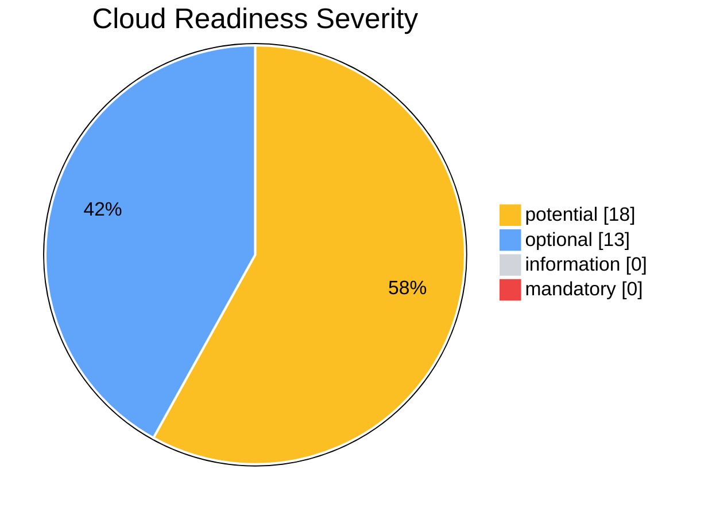
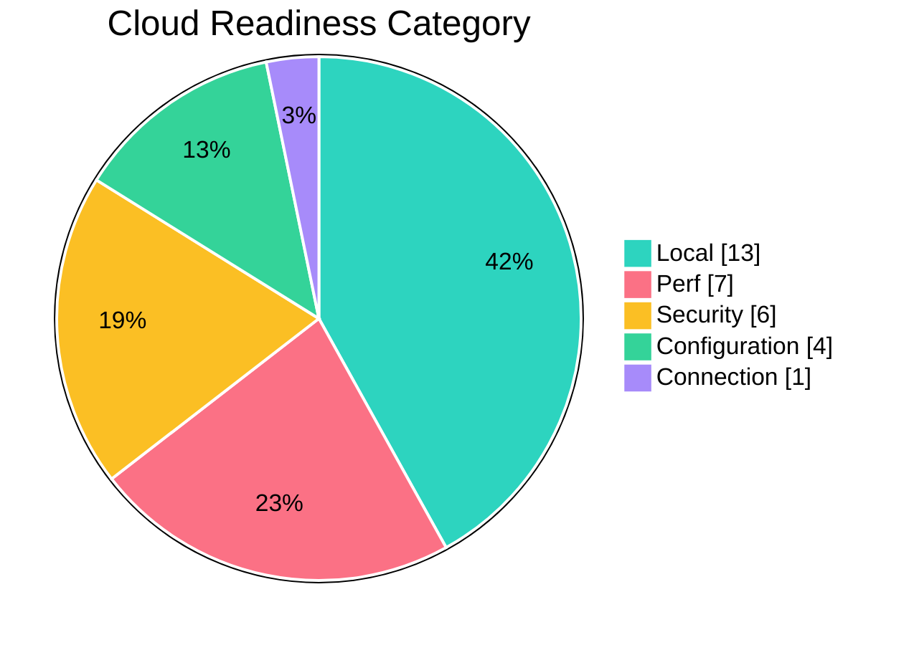
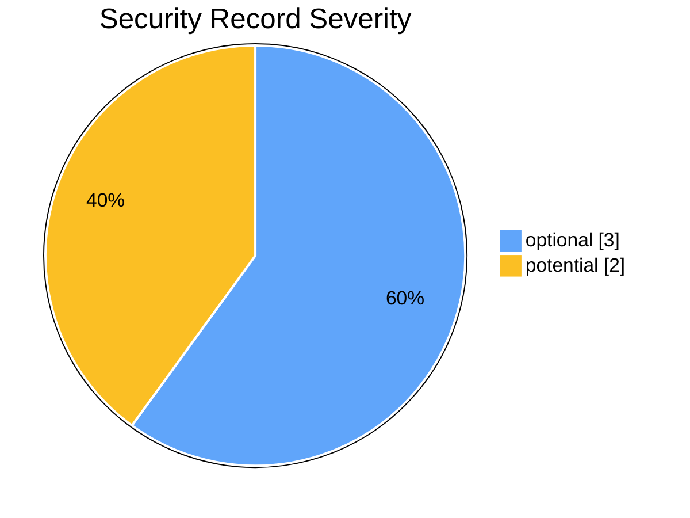
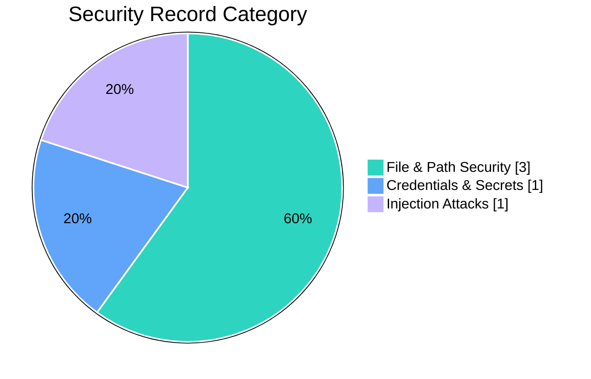
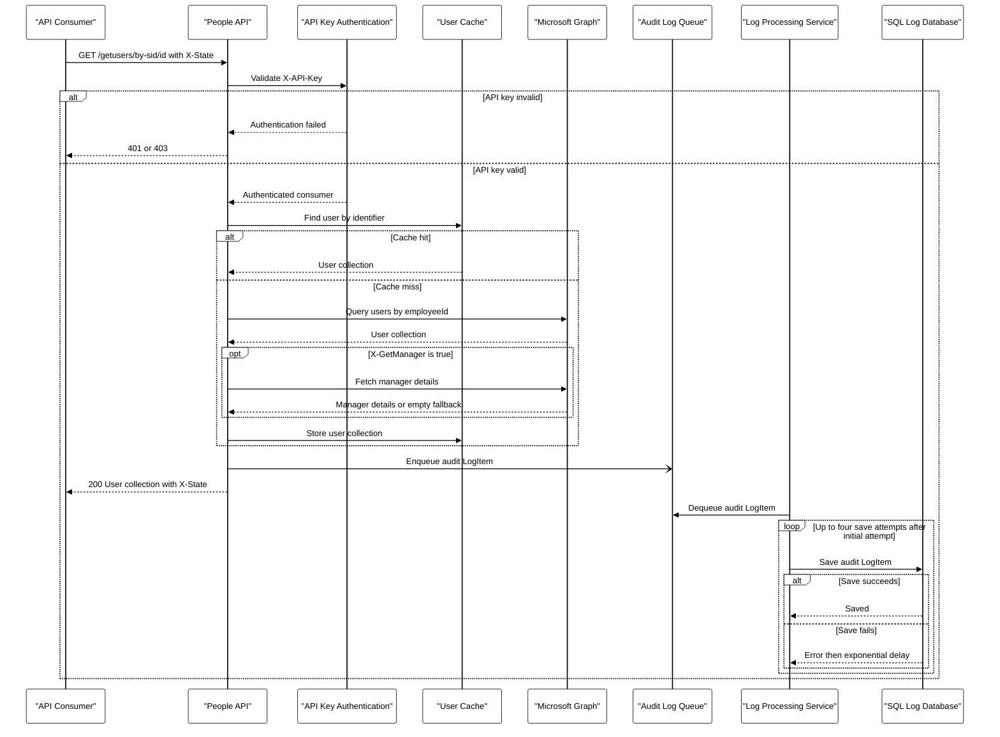
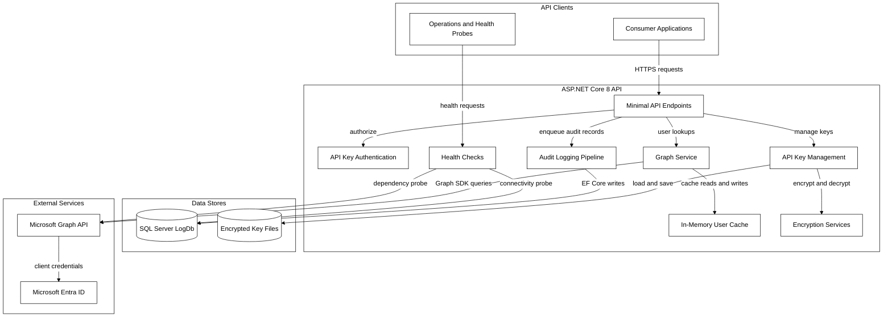
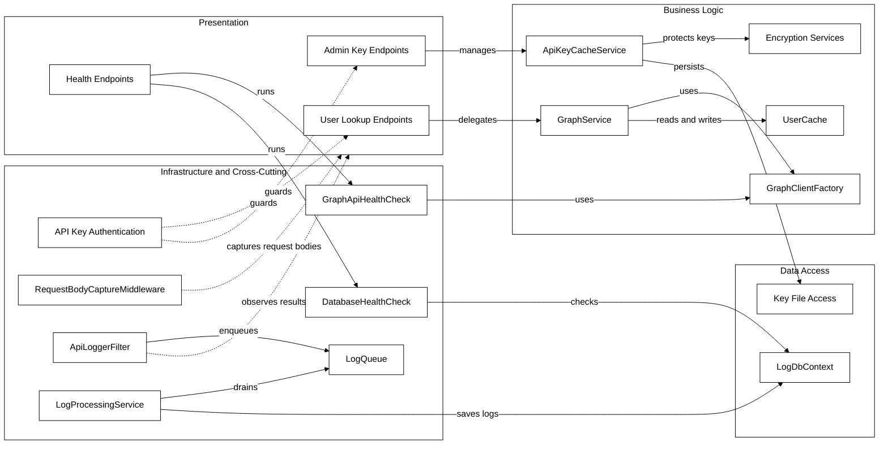
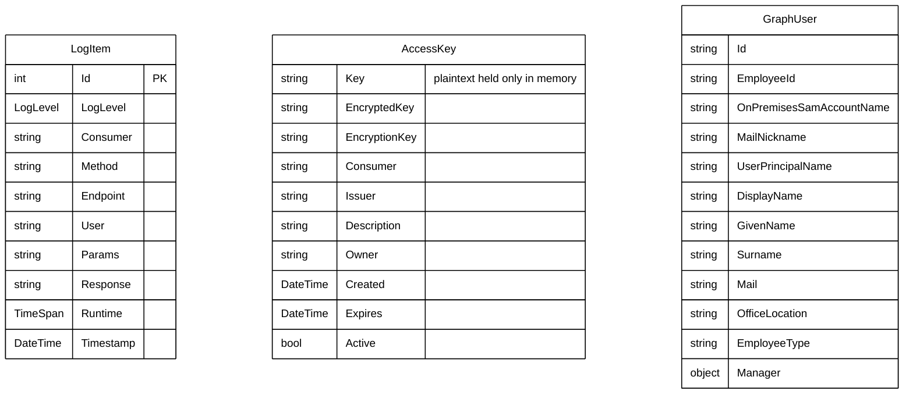
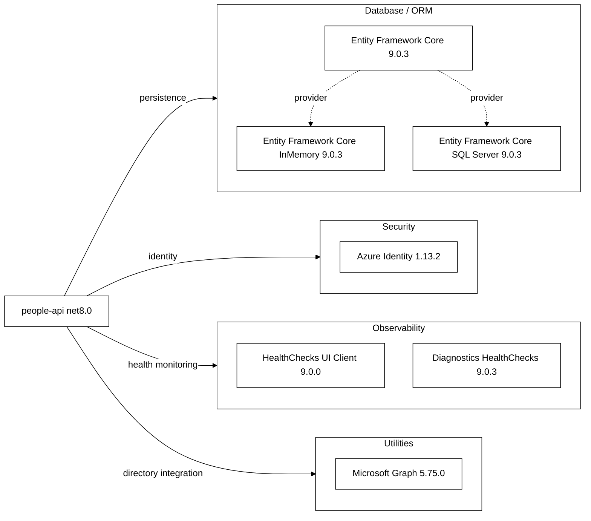

# App Modernisation Assessment Reports: Report_20261001115651 and Report_20261001120803

This self-contained document combines the historical cloud-readiness assessment `Report_20261001115651` and the historical cloud-readiness/security assessment `Report_20261001120803`. The source artifacts were produced between **2026-10-01T09:56:51.537Z** and **2026-10-01T10:17:16.922Z**; this is a Markdown export, not a fresh scan. The second report repeats the same cloud findings with newly generated incident IDs, so those findings are consolidated below while both IDs are retained.

> **Source note:** The approved layout reference named by the export instructions (`docs/Report_20260825232217.md`) was not present in this checkout. This report therefore follows the explicit layout and Mermaid styling requirements in the conversion prompt.

## Contents

- [Assessment Metadata](#assessment-metadata)
- [Assessment Summary](#assessment-summary)
- [Cloud Readiness Findings](#cloud-readiness-findings)
- [Security Findings](#security-findings)
- [Migration Solution Mapping](#migration-solution-mapping)
- [Supporting Analysis and Original Diagrams](#supporting-analysis-and-original-diagrams)

## Assessment Metadata

### Cloud-readiness source: Report_20261001115651

- **Report name / ID:** Report_20261001115651 / `20261001115651`
- **Format / producer:** 1.0.0 / .NET AppCAT CLI
- **Status / mode:** completed / full
- **Assessment period (UTC):** 2026-10-01T09:56:51.537Z to 2026-10-01T10:01:38.924Z
- **Privacy:** Protected ([help](https://aka.ms/appmod-privacy-mode))
- **Targets:** Azure Container Apps (`ACA`)
- **Domains:** cloud-readiness
- **Minimum CVE severity / scan scope:** high / direct
- **Capabilities:** None specified
- **Operating systems:** None specified
- **Source folder:** `.github/modernize/assessment/reports/report-20261001115651/`

### Security source: Report_20261001120803

- **Report name / ID:** Report_20261001120803 / `20261001120803`
- **Format / producer:** 1.0.0 / .NET AppCAT CLI
- **Status / mode:** completed / issue-only
- **Assessment period (UTC):** 2026-10-01T10:08:03.990Z to 2026-10-01T10:17:16.922Z
- **Privacy:** Protected ([help](https://aka.ms/appmod-privacy-mode))
- **Targets:** IDs: AppService.Windows, AppService.Linux, AKS.Windows, AKS.Linux, ACA, AppServiceContainer.Linux, AppServiceContainer.Windows, AppServiceManagedInstance.Windows; Names: Azure App Service, Azure Kubernetes Service, Azure Container Apps, Azure App Service Container, Azure App Service Managed Instance
- **Domains:** security, cloud-readiness
- **Minimum CVE severity / scan scope:** high / direct
- **Capabilities:** None specified
- **Operating systems:** None specified
- **Source folder:** `.github/modernize/assessment/reports/report-20261001120803/`

### Source discrepancies

- The report summaries, rules, project totals, evidence, target ratings, and migration mappings are identical. All **31** cloud incident IDs were regenerated in the later report; both source IDs are shown in the incident tables.
- `Report_20261001115651` selected only Azure Container Apps in its metadata. `Report_20261001120803` lists eight target IDs across five display-name families and uses `issue-only` mode.
- The later report contains five CWE records but no CVE records, despite retaining a configured minimum CVE severity and scan scope.

## Assessment Summary

| Group | Metric | Value |
|---|---|---:|
| Cloud readiness | Projects | 2 |
| Cloud readiness | Issues | 5 |
| Cloud readiness | Incidents | 31 |
| Cloud readiness | Effort (story points) | 71 |
| Cloud severity | mandatory | 0 |
| Cloud severity | optional | 13 |
| Cloud severity | potential | 18 |
| Cloud severity | information | 0 |
| Cloud category | Configuration | 4 |
| Cloud category | Connection | 1 |
| Cloud category | Local | 13 |
| Cloud category | Perf | 7 |
| Cloud category | Security | 6 |
| Security | Source records | 5 |
| Security | CWE records | 5 |
| Security | CVE records | 0 |
| Security | Effort (story points) | 24 |
| Security severity | optional | 3 |
| Security severity | potential | 2 |
| Security category | Credentials &amp; Secrets | 1 |
| Security category | File &amp; Path Security | 3 |
| Security category | Injection Attacks | 1 |

The later report repeats the cloud summary above exactly; the values are not added together. Security records and their story-point effort are reported separately from cloud-readiness incidents and effort.

### Cloud Readiness Severity

**Colour key:** potential = `#FBBF24`; optional = `#60A5FA`; information = `#D1D5DB`; mandatory = `#EF4444`.

### Cloud Readiness Category

**Colour key:** Local = `#2DD4BF`; Perf = `#FB7185`; Security = `#FBBF24`; Configuration = `#34D399`; Connection = `#A78BFA`.

### Security Record Severity

**Colour key:** optional = `#60A5FA`; potential = `#FBBF24`.

### Security Record Category

**Colour key:** File & Path Security = `#2DD4BF`; Credentials & Secrets = `#60A5FA`; Injection Attacks = `#C4B5FD`.

## Cloud Readiness Findings

The selected cloud-readiness target is **Azure Container Apps** (`ACA`). The source also supplies ratings for the other targets shown under each rule.

### Project Overview

| Project | Application | Frameworks | Languages | Build tools | Issues | Incidents | Effort (Story Points) |
|---|---|---|---|---|---:|---:|---:|
| `defra-people-api-tests\defra-people-api-tests.csproj` | defra-people-api-tests | net8.0 | C# | MSBuild | 2 | 8 | 24 |
| `defra-people-api\defra-people-api.csproj` | defra-people-api | net8.0 | C# | MSBuild | 4 | 23 | 47 |

### Findings Overview

| Rule | Title | Finding type | Incidents | Source severity | Source effort | Azure Container Apps ratings |
|---|---|---|---:|---|---:|---|
| `Configuration.0003` | Local application configuration detected | Configuration | 4 | potential | 1 | potential / 1: 4 incident(s) |
| `Connection.0001` | Connection string is detected | Connection | 1 | potential | 3 | potential / 3: 1 incident(s) |
| `Local.0003` | Local or network IO operations detected | Local | 13 | potential | 3 | potential / 3: 13 incident(s) |
| `Perf.0001` | Synchronous API usage detected | Perf | 7 | optional | 1 | optional / 1: 7 incident(s) |
| `Security.0003` | Hardcoded sensitive data detected | Security | 6 | optional | 3 | optional / 3: 6 incident(s) |

### Configuration.0003: Local application configuration detected

**Guidance:** Local application configuration detected. Azure App Configuration can be used as a centralized, cloud-based service for application settings that are currently stored in local configuration files. Moving this configuration to Azure App Configuration can help you externalize settings from code and deployment artifacts, centralize management across environments, and enable dynamic refresh and controlled access to configuration data.

- **Source severity:** potential
- **Source effort:** 1
- **Labels:** None specified
- **References:** [What is Azure App Configuration?](https://learn.microsoft.com/azure/azure-app-configuration/overview); [Configuration management with Azure App Configuration](https://aka.ms/appconfig/configuration-management)

#### Target Ratings

| Target | Severity | Effort |
|---|---|---:|
| `AppService.Windows` | potential | 1 |
| `AppService.Linux` | potential | 1 |
| `AKS.Linux` | potential | 1 |
| `AKS.Windows` | potential | 1 |
| `ACA` | potential | 1 |
| `AppServiceContainer.Linux` | potential | 1 |
| `AppServiceContainer.Windows` | potential | 1 |
| `AppServiceManagedInstance.Windows` | potential | 1 |

These target ratings apply to all 4 incidents for this rule.

#### Incident Evidence

| Cloud report incident ID | Later report incident ID | Project | Location | Location kind | Evidence | Labels |
|---|---|---|---|---|---|---|
| `b09b7ddf-5213-4579-906c-dd1de1198eb0` | `5e9cf5bd-0a15-43e1-9744-a10eba5205ae` | `defra-people-api\defra-people-api.csproj` | [defra-people-api/appsettings.json](../defra-people-api/appsettings.json) | File | Authentication | None specified |
| `81b653bc-c2a9-4920-a847-ac81d71e0595` | `02cbc392-91c6-4cbf-9a1f-b94fdc291ead` | `defra-people-api\defra-people-api.csproj` | [defra-people-api/appsettings.json](../defra-people-api/appsettings.json) | File | ConnectionStrings | None specified |
| `e57f0edd-170b-486e-a588-a7aeaeff4ea0` | `dbda9508-7c76-4499-90b9-580ea35f0e25` | `defra-people-api\defra-people-api.csproj` | [defra-people-api/appsettings.json](../defra-people-api/appsettings.json) | File | Encryption | None specified |
| `45aec099-1eeb-43b0-bab5-470f31eef4d1` | `ba2b946e-44ee-4bd4-ae44-619f67866755` | `defra-people-api\defra-people-api.csproj` | [defra-people-api/appsettings.json](../defra-people-api/appsettings.json) | File | GraphApi | None specified |

### Connection.0001: Connection string is detected

**Guidance:** Connection string detected. It may not be available when your app is migrated to Azure.  Review and ensure it works from Azure. If you are connecting to a database, you might need to migrate the database to Azure. There are multiple ways to do it:     1. Migrate to Azure SQL Database for additional benefits (see the link below).     2. Consider Azure SQL Managed Instance if you need features that are not available in Azure SQL Database and you don’t want to use a VM.     3. Migrate your database servers directly to SQL Server on Azure VMs.  To assess database migration effort, you can use Azure Migrate tool, see the link below.

- **Source severity:** potential
- **Source effort:** 3
- **Labels:** None specified
- **References:** [Migrate SQL Server database to Azure](https://go.microsoft.com/fwlink/?LinkID=2251731); [Azure SQL Managed Instance](https://go.microsoft.com/fwlink/?LinkID=2251613); [Azure Migrate](https://go.microsoft.com/fwlink/?linkid=2252410)

#### Target Ratings

| Target | Severity | Effort |
|---|---|---:|
| `AppService.Windows` | potential | 3 |
| `AppService.Linux` | potential | 3 |
| `AKS.Linux` | potential | 3 |
| `AKS.Windows` | potential | 3 |
| `ACA` | potential | 3 |
| `AppServiceContainer.Linux` | potential | 3 |
| `AppServiceContainer.Windows` | potential | 3 |
| `AppServiceManagedInstance.Windows` | potential | 3 |

These target ratings apply to all 1 incidents for this rule.

#### Incident Evidence

| Cloud report incident ID | Later report incident ID | Project | Location | Location kind | Evidence | Labels |
|---|---|---|---|---|---|---|
| `c70fcc93-19a6-4bf3-a504-4147f47c6242` | `ae64df96-da24-4d31-89bb-56b2997ad025` | `defra-people-api\defra-people-api.csproj` | [defra-people-api/appsettings.json](../defra-people-api/appsettings.json) | File | LogDb | None specified |

### Local.0003: Local or network IO operations detected

**Guidance:** Your application has local or network IO operations.  If you are targeting Managed Instance on Azure App Service, move persistent I/O to storage mounts (Azure Files/UNC). Keep local writes to temp only; connect to external dependencies via private endpoints/VNet to reduce latency.  IO operations outside of the application folder might not be available on Azure App Service. Review and ensure IO APIs are attempting to access paths that will be available when your app is running on App Service sandbox. If you choose the containerized hosting option, your scenario still might be broken or have scalability issues.  Possible solutions:     1. Files that the application needs can be deployed with the application or put in Azure Storage. You can use Azure Storage File Shares as a drop-in replacement for on-premises file share.     2. Other services that the application depends on might need to be migrated to Azure, this way you will get the benefit of lower latency in the cloud.     3. If your application needs to depend on services that run on-premise, you can connect your Azure and local networks with ExpressRoute, Hybrid Connections, or VPN solutions.

- **Source severity:** potential
- **Source effort:** 3
- **Labels:** None specified
- **References:** [[Managed Instance] Storage mounts](https://go.microsoft.com/fwlink/?linkid=2346952); [Azure file share](https://go.microsoft.com/fwlink/?LinkID=2242591); [ExpressRoute](https://go.microsoft.com/fwlink/?LinkID=2250577); [Hybrid Connections](https://go.microsoft.com/fwlink/?LinkID=2242588); [Connect an on-prem network](https://go.microsoft.com/fwlink/?LinkID=2242591); [Design to scale out](https://go.microsoft.com/fwlink/?linkid=2251007)

#### Target Ratings

| Target | Severity | Effort |
|---|---|---:|
| `AppService.Windows` | potential | 3 |
| `AppService.Linux` | potential | 3 |
| `AKS.Linux` | potential | 3 |
| `AKS.Windows` | potential | 3 |
| `ACA` | potential | 3 |
| `AppServiceContainer.Linux` | potential | 3 |
| `AppServiceContainer.Windows` | potential | 3 |
| `AppServiceManagedInstance.Windows` | potential | 3 |

These target ratings apply to all 13 incidents for this rule.

#### Incident Evidence

| Cloud report incident ID | Later report incident ID | Project | Location | Location kind | Evidence | Labels |
|---|---|---|---|---|---|---|
| `d61403a5-c389-4d75-95dd-8b1ee275c65b` | `5cae26b0-0340-4e1b-a77a-5a58923a7482` | `defra-people-api-tests\defra-people-api-tests.csproj` | [defra-people-api-tests/Cache/ApiKeyCacheServiceTests.cs:133:20](../defra-people-api-tests/Cache/ApiKeyCacheServiceTests.cs#L133) | File | System.IO.Directory | None specified |
| `b9d20219-1c88-4b6f-b537-4ae406cd2650` | `8d076543-17ef-480b-8dfc-c78fa722b1a5` | `defra-people-api-tests\defra-people-api-tests.csproj` | [defra-people-api-tests/Cache/ApiKeyCacheServiceTests.cs:134:23](../defra-people-api-tests/Cache/ApiKeyCacheServiceTests.cs#L134) | File | System.IO.Directory | None specified |
| `beb68990-56e7-43c2-ae45-9228b4070222` | `dbb78633-0808-49d2-83ea-97f1d253aadf` | `defra-people-api\defra-people-api.csproj` | [defra-people-api/Cache/ApiKeyCacheService.cs:17:38](../defra-people-api/Cache/ApiKeyCacheService.cs#L17) | File | System.IO.Directory | None specified |
| `603a9fca-ec5c-4387-b084-f64367c36938` | `610645e2-8a77-4f3f-a763-d993ab22178c` | `defra-people-api\defra-people-api.csproj` | [defra-people-api/Cache/ApiKeyCacheService.cs:129:18](../defra-people-api/Cache/ApiKeyCacheService.cs#L129) | File | System.IO.File | None specified |
| `dcc88338-67ad-4457-b1c8-d15a3d80597b` | `99029382-4a90-4e21-8607-36f2ea91914a` | `defra-people-api\defra-people-api.csproj` | [defra-people-api/Cache/ApiKeyCacheService.cs:113:12](../defra-people-api/Cache/ApiKeyCacheService.cs#L113) | File | System.IO.Directory | None specified |
| `e6f32747-212a-4952-8c5e-3c9ef31d230d` | `d70531ea-fa79-4597-a1e5-6beeef26bebd` | `defra-people-api\defra-people-api.csproj` | [defra-people-api/Cache/ApiKeyCacheService.cs:30:16](../defra-people-api/Cache/ApiKeyCacheService.cs#L30) | File | System.IO.Directory | None specified |
| `0141503c-c242-45fb-9d49-f75475c0e578` | `9ea5fb5c-2995-499d-b6d4-c3f5b12b0e6e` | `defra-people-api\defra-people-api.csproj` | [defra-people-api/Cache/ApiKeyCacheService.cs:28:17](../defra-people-api/Cache/ApiKeyCacheService.cs#L28) | File | System.IO.Directory | None specified |
| `4e46d019-2517-4de1-be0f-6b9530f81d5e` | `f2dda1d6-9d3d-48ae-a34c-dffaa973dfc3` | `defra-people-api\defra-people-api.csproj` | [defra-people-api/Cache/ApiKeyCacheService.cs:111:13](../defra-people-api/Cache/ApiKeyCacheService.cs#L111) | File | System.IO.Directory | None specified |
| `c411c8de-2d7a-4bc6-81f8-a430c9884258` | `793730f6-98e4-45c6-873d-6822049f9d55` | `defra-people-api\defra-people-api.csproj` | [defra-people-api/Cache/ApiKeyCacheService.cs:43:31](../defra-people-api/Cache/ApiKeyCacheService.cs#L43) | File | System.IO.File | None specified |
| `48cc6b8b-297d-4a9c-9f77-0d09fd02d6e3` | `22377a96-cd6a-4abe-a7d0-47e73b161ac1` | `defra-people-api\defra-people-api.csproj` | [defra-people-api/Cache/ApiKeyCacheService.cs:36:27](../defra-people-api/Cache/ApiKeyCacheService.cs#L36) | File | System.IO.Directory | None specified |
| `f6948aeb-1900-459e-ab86-7659e34b4994` | `9c59f83a-eabe-4708-b1af-8a1da19feea5` | `defra-people-api\defra-people-api.csproj` | [defra-people-api/Services/Crypto/EncryptedConfigService.cs:166:12](../defra-people-api/Services/Crypto/EncryptedConfigService.cs#L166) | File | System.IO.File | None specified |
| `fff4e3e5-ad8e-40ef-9d47-9be36f45b0ab` | `e629e9c2-f8a3-492e-b19a-733049e5b9ea` | `defra-people-api\defra-people-api.csproj` | [defra-people-api/Services/Crypto/EncryptedConfigService.cs:102:13](../defra-people-api/Services/Crypto/EncryptedConfigService.cs#L102) | File | System.IO.File | None specified |
| `4d86cfbd-b490-4f5e-908a-b7b975764de5` | `7ca594fe-a713-4c6b-98ed-c85215901f75` | `defra-people-api\defra-people-api.csproj` | [defra-people-api/Services/Crypto/EncryptedConfigService.cs:110:23](../defra-people-api/Services/Crypto/EncryptedConfigService.cs#L110) | File | System.IO.File | None specified |

### Perf.0001: Synchronous API usage detected

**Guidance:** Synchronous API usage detected.  Using synchronous APIs can lead to more performance issues in Azure compared to on-premises environments due to different latency profiles. Consider adopting asynchronous code patterns.  In heavily loaded systems, especially where the I/O is substantial, using asynchronous patterns can improve overall throughput and performance. Asynchronous APIs enable a small pool of threads to manage thousands of concurrent requests without waiting on blocking calls. Instead of waiting for a long-running synchronous task to finish, the thread can handle another request. Conversely, numerous synchronous blocking calls can cause thread pool starvation and degrade response times.  Refer to the links below to learn more about asynchronous programming.

- **Source severity:** optional
- **Source effort:** 1
- **Labels:** None specified
- **References:** [Asynchronous programming](https://go.microsoft.com/fwlink/?linkid=2294824); [ASP.NET Core Best Practices: avoid blocking calls](https://go.microsoft.com/fwlink/?linkid=2294727)

#### Target Ratings

| Target | Severity | Effort |
|---|---|---:|
| `AppService.Windows` | optional | 1 |
| `AppService.Linux` | optional | 1 |
| `AKS.Linux` | optional | 1 |
| `AKS.Windows` | optional | 1 |
| `ACA` | optional | 1 |
| `AppServiceContainer.Linux` | optional | 1 |
| `AppServiceContainer.Windows` | optional | 1 |
| `AppServiceManagedInstance.Windows` | optional | 1 |

These target ratings apply to all 7 incidents for this rule.

#### Incident Evidence

| Cloud report incident ID | Later report incident ID | Project | Location | Location kind | Evidence | Labels |
|---|---|---|---|---|---|---|
| `39d19400-39c4-4731-8ab0-897a043908d7` | `178558d5-772e-41cc-97fa-849cd975e82d` | `defra-people-api\defra-people-api.csproj` | [defra-people-api/Cache/ApiKeyCacheService.cs:43:31](../defra-people-api/Cache/ApiKeyCacheService.cs#L43) | File | System.IO.File.ReadAllText | None specified |
| `67ab3fd4-db32-48f6-a232-1ffa3c3ff24b` | `2a4fc144-0370-4fa7-8114-569a2221e8c8` | `defra-people-api\defra-people-api.csproj` | [defra-people-api/Endpoints/GET/AdminDumpCacheEndpoint.cs:28:28](../defra-people-api/Endpoints/GET/AdminDumpCacheEndpoint.cs#L28) | File | System.Threading.Tasks.Task`1.Result | None specified |
| `4549da82-0836-4f9c-9291-0fa2d26fb19f` | `dce16096-2585-495d-b0d7-3f0bd5357139` | `defra-people-api\defra-people-api.csproj` | [defra-people-api/Endpoints/GET/AdminListApiKeysEndpoint.cs:37:50](../defra-people-api/Endpoints/GET/AdminListApiKeysEndpoint.cs#L37) | File | System.Threading.Tasks.Task`1.Result | None specified |
| `4b24cb3b-bbe2-4006-a0fe-f75e4eb45163` | `95656cfe-ca88-461f-96fd-2ccb5aaa3b61` | `defra-people-api\defra-people-api.csproj` | [defra-people-api/Endpoints/GET/AdminListApiKeysEndpoint.cs:28:27](../defra-people-api/Endpoints/GET/AdminListApiKeysEndpoint.cs#L28) | File | System.Threading.Tasks.Task`1.Result | None specified |
| `1465cc57-bfb6-4cce-9e68-dbb4943d9662` | `d04fa303-3735-476a-887f-b3867ba1bb8d` | `defra-people-api\defra-people-api.csproj` | [defra-people-api/Services/ApiLogger/ApiLoggerFilter.cs:84:30](../defra-people-api/Services/ApiLogger/ApiLoggerFilter.cs#L84) | File | System.Threading.Tasks.Task`1.Result | None specified |
| `bde37e6d-c333-420d-a0cf-988b8de87e03` | `447d68e4-2078-41c1-b768-7141a11ca68d` | `defra-people-api\defra-people-api.csproj` | [defra-people-api/Services/Crypto/EncryptedConfigService.cs:166:12](../defra-people-api/Services/Crypto/EncryptedConfigService.cs#L166) | File | System.IO.File.WriteAllText | None specified |
| `ab468cda-031a-4702-b55b-1a04d0416ea1` | `687d8f40-98bb-454b-86d2-1c87fe2e2322` | `defra-people-api\defra-people-api.csproj` | [defra-people-api/Services/Crypto/EncryptedConfigService.cs:110:23](../defra-people-api/Services/Crypto/EncryptedConfigService.cs#L110) | File | System.IO.File.ReadAllText | None specified |

### Security.0003: Hardcoded sensitive data detected

**Guidance:** Hardcoded sensitive data detected.  If you are targeting Managed Instance on Azure App Service, externalize secrets to Key Vault/App Configuration; use managed identity instead of passwords or embedded connection strings.  While if targeting other Azure compute services:  Avoid placing sensitive data such as passwords, ids, tokens etc., directly in config files and code since it compromises the security of your application.  Use Azure App Configuration or Azure KeyVault to store secrets.

- **Source severity:** optional
- **Source effort:** 3
- **Labels:** None specified
- **References:** [Centralized app configuration and security](https://go.microsoft.com/fwlink/?LinkID=2250733)

#### Target Ratings

| Target | Severity | Effort |
|---|---|---:|
| `AppService.Windows` | optional | 3 |
| `AppService.Linux` | optional | 3 |
| `AKS.Linux` | optional | 3 |
| `AKS.Windows` | optional | 3 |
| `ACA` | optional | 3 |
| `AppServiceContainer.Linux` | optional | 3 |
| `AppServiceContainer.Windows` | optional | 3 |
| `AppServiceManagedInstance.Windows` | mandatory | 3 |

These target ratings apply to all 6 incidents for this rule.

#### Incident Evidence

| Cloud report incident ID | Later report incident ID | Project | Location | Location kind | Evidence | Labels |
|---|---|---|---|---|---|---|
| `5f68d103-0fe1-4e4a-8098-67f2b7437232` | `670fb3cb-0be0-48e7-90d9-b7675463bb20` | `defra-people-api-tests\defra-people-api-tests.csproj` | [defra-people-api-tests/Services/Graph/GraphClientFactoryTests.cs:45:17](../defra-people-api-tests/Services/Graph/GraphClientFactoryTests.cs#L45) | File | secret | None specified |
| `c15f29bd-4c5f-4970-b7d5-42035ab8f406` | `3ce7805b-528b-4b28-97bb-69241f65a26f` | `defra-people-api-tests\defra-people-api-tests.csproj` | [defra-people-api-tests/Services/Graph/GraphClientFactoryTests.cs:45:42](../defra-people-api-tests/Services/Graph/GraphClientFactoryTests.cs#L45) | File | secret | None specified |
| `7b35345a-153d-49e6-be61-f066dcbb43b6` | `810355f4-31aa-467e-b6e1-a988e6450bbb` | `defra-people-api-tests\defra-people-api-tests.csproj` | [defra-people-api-tests/Services/Graph/GraphClientFactoryTests.cs:21:17](../defra-people-api-tests/Services/Graph/GraphClientFactoryTests.cs#L21) | File | secret | None specified |
| `00d94fa1-cf69-4f0d-bba5-334bdd593b17` | `04e7e5c8-0cf3-482d-8372-07639ed943d0` | `defra-people-api-tests\defra-people-api-tests.csproj` | [defra-people-api-tests/Services/Graph/GraphClientFactoryTests.cs:21:42](../defra-people-api-tests/Services/Graph/GraphClientFactoryTests.cs#L21) | File | secret | None specified |
| `32616072-0e77-42c3-8f0f-ce99a5a07d50` | `5508fe92-14a0-4389-9301-4170265b4999` | `defra-people-api-tests\defra-people-api-tests.csproj` | [defra-people-api-tests/Services/Graph/GraphClientFactoryTests.cs:70:17](../defra-people-api-tests/Services/Graph/GraphClientFactoryTests.cs#L70) | File | secret | None specified |
| `081ed0b7-52db-4fcd-a82e-4a45f5cabefd` | `72a78125-7e1d-4f5f-982c-b3f00a92a327` | `defra-people-api-tests\defra-people-api-tests.csproj` | [defra-people-api-tests/Services/Graph/GraphClientFactoryTests.cs:70:42](../defra-people-api-tests/Services/Graph/GraphClientFactoryTests.cs#L70) | File | secret | None specified |

## Security Findings

The security source contains **5** records: all are CWEs and none are CVEs. Source assessment severity is retained below and must not be interpreted as a CVSS or advisory rating.

| ID | Title | Category | Severity | Description | Files | Evidence | Effort (Story Points) |
|---|---|---|---|---|---|---|---:|
| `CWE-778` | Insufficient Logging | Credentials &amp; Secrets | potential | When a security-critical event occurs, the product either does not record the event or omits important details about the event when logging it. | [defra-people-api/Program.cs](../defra-people-api/Program.cs) [defra-people-api/Endpoints/EndpointLoggingExtension.cs](../defra-people-api/Endpoints/EndpointLoggingExtension.cs) [defra-people-api/appsettings.json](../defra-people-api/appsettings.json) | Authentication and authorization failures occur before the endpoint audit filter executes. Program.cs lines 19, 28, 32, 105-106 and EndpointLoggingExtension.cs lines 12-14 provide no failure audit handler, while appsettings.json line 5 restricts ASP.NET Core logging to Warning. | 3 |
| `CWE-22` | Improper Limitation of a Pathname to a Restricted Directory ('Path Traversal') | File &amp; Path Security | optional | The product uses external input to construct a pathname that is intended to identify a file or directory that is located underneath a restricted parent directory, but the product does not properly neutralize special elements within the pathname that can cause the pathname to resolve to a location that is outside of the restricted directory. | [defra-people-api/Endpoints/POST/GenerateApiKeyEndpoint.cs](../defra-people-api/Endpoints/POST/GenerateApiKeyEndpoint.cs) [defra-people-api/Cache/ApiKeyCacheService.cs](../defra-people-api/Cache/ApiKeyCacheService.cs) | GenerateApiKeyEndpoint accepts request-controlled consumer input at lines 28 and 47. ApiKeyCacheService uses that value to build and write a key file at lines 126-130 without canonicalizing the result or ensuring it remains under the Keys directory. | 8 |
| `CWE-23` | Relative Path Traversal | File &amp; Path Security | optional | The product uses external input to construct a pathname that should be within a restricted directory, but it does not properly neutralize sequences such as .. that can resolve to a location that is outside of that directory. | [defra-people-api/Endpoints/POST/GenerateApiKeyEndpoint.cs](../defra-people-api/Endpoints/POST/GenerateApiKeyEndpoint.cs) [defra-people-api/Cache/ApiKeyCacheService.cs](../defra-people-api/Cache/ApiKeyCacheService.cs) | GenerateApiKeyEndpoint accepts request-controlled consumer input at lines 28 and 47. ApiKeyCacheService permits relative traversal sequences in that value when building and writing the key file at lines 126-130. | 5 |
| `CWE-36` | Absolute Path Traversal | File &amp; Path Security | optional | The product uses external input to construct a pathname that should be within a restricted directory, but it does not properly neutralize absolute path sequences such as /abs/path that can resolve to a location that is outside of that directory. | [defra-people-api/Endpoints/POST/GenerateApiKeyEndpoint.cs](../defra-people-api/Endpoints/POST/GenerateApiKeyEndpoint.cs) [defra-people-api/Cache/ApiKeyCacheService.cs](../defra-people-api/Cache/ApiKeyCacheService.cs) | GenerateApiKeyEndpoint accepts request-controlled consumer input at lines 28 and 47. ApiKeyCacheService does not reject rooted paths before Path.Combine and File.WriteAllTextAsync at lines 126-130. | 5 |
| `CWE-99` | Improper Control of Resource Identifiers ('Resource Injection') | Injection Attacks | potential | The product receives input from an upstream component, but it does not restrict or incorrectly restricts the input before it is used as an identifier for a resource that may be outside the intended sphere of control. | [defra-people-api/Endpoints/POST/GenerateApiKeyEndpoint.cs](../defra-people-api/Endpoints/POST/GenerateApiKeyEndpoint.cs) [defra-people-api/Cache/ApiKeyCacheService.cs](../defra-people-api/Cache/ApiKeyCacheService.cs) | Request-controlled consumer input flows from GenerateApiKeyEndpoint lines 28 and 47 into the key-file resource identifier used by ApiKeyCacheService at lines 126-130, allowing creation outside the intended directory. | 3 |

No advisory URLs, affected-dependency fields, recommended-fix fields, or advisory/CVSS severities were supplied in these five source records.

## Migration Solution Mapping

The mapping is identical in `Report_20261001115651` and `Report_20261001120803`.

| Rule | Migration Solution | Source Reports |
|---|---|---|
| `Local.0003` | `file-system-management-prompt` | Report_20261001115651, Report_20261001120803 |
| `Security.0003` | `plaintext-credential-to-azure-keyvault` | Report_20261001115651, Report_20261001120803 |
| `Connection.0001` | `plaintext-credential-to-azure-keyvault` | Report_20261001115651, Report_20261001120803 |
| `Configuration.0003` | `local-appsettings-to-azure-app-configuration` | Report_20261001115651, Report_20261001120803 |
| `Perf.0001` | `performance-optimization-prompt` | Report_20261001115651, Report_20261001120803 |

## Supporting Analysis and Original Diagrams

The following 6 supporting documents are included from `.github/modernize/assessment/reports/report-20261001115651/facts/`. Heading levels and Mermaid styling have been normalised for this combined report; substantive prose, tables, code, diagram nodes, relationships, labels, and workflow order are preserved.

### API & Service Communication Contracts

The workspace exposes 12 HTTP endpoints from one People API service: three authenticated Microsoft Graph user lookups, five admin operations, a public root endpoint, and three public health endpoints. Request handling is synchronous, while API audit records are queued in-process and persisted asynchronously.

#### Service Catalog

| Service | Port | Category | Purpose |
|---|---|---|---|
| `defra-people-api` | Not fixed in source; assigned by the ASP.NET Core host | API Layer | ASP.NET Core minimal API that authenticates consumers, serves user lookups backed by Microsoft Graph, provides API-key/cache administration, and emits health status. Key dependencies are Microsoft Graph, Azure Identity, Entity Framework Core SQL Server, and ASP.NET Core health checks. |

`defra-people-api-tests` is an xUnit test project, not an independently deployable service. No Docker Compose services, Kubernetes deployments, Helm charts, or infrastructure-as-code service definitions were found.

#### API Endpoints Inventory

All endpoints are unversioned; no URL-, header-, or query-based API versioning scheme is present. Except where noted, the fallback authorization policy requires a valid `X-API-Key`. The three user lookup endpoints also require `X-State`, echo it in the response, and accept optional boolean header `X-GetManager`.

| Service | Method | Path | Request Type | Response Type |
|---|---|---|---|---|
| `defra-people-api` | GET | `/` | None; anonymous | `200` plain-text greeting |
| `defra-people-api` | GET | `/getusers/by-sid/{id}` | Path `id`; headers `X-State` and optional `X-GetManager` | `200` collection of Microsoft Graph `User`; `400` when `X-State` is absent; authentication failures produce `401`/`403` |
| `defra-people-api` | GET | `/getusers/by-mailnickname/{id}` | Path `id`; headers `X-State` and optional `X-GetManager` | `200` collection of Microsoft Graph `User`; `400` when `X-State` is absent; authentication failures produce `401`/`403` |
| `defra-people-api` | GET | `/getusers/by-samaccount/{id}` | Path `id`; headers `X-State` and optional `X-GetManager` | `200` collection of Microsoft Graph `User`; `400` when `X-State` is absent; authentication failures produce `401`/`403` |
| `defra-people-api` | GET | `/admin/list-api-keys` | Headers `X-API-Key` with the configured admin key and `X-State` | `200` object containing `AccessKey` items; `400` for missing state; `403` for a non-admin key; `500` problem result if retrieval faults |
| `defra-people-api` | GET | `/admin/dump-cache` | Headers `X-API-Key` with the configured admin key and `X-State` | `200` projected Microsoft Graph `User` collection; `400` for missing state; `403` for a non-admin key; `500` problem result if retrieval faults |
| `defra-people-api` | POST | `/admin/generate-api-key` | Headers `X-API-Key` with the configured admin key and `X-State`; JSON body compatible with `GenerateApiKeyRequest`, parsed directly as `JsonElement` | `200` anonymous object containing the one-time `apiKey` and warning message; `400` for missing state or malformed required JSON; `403` for a non-admin key |
| `defra-people-api` | POST | `/admin/refresh-api-keys` | Headers `X-API-Key` with the configured admin key and `X-State`; no body | `200` message object; `400` for missing state; `403` for a non-admin key |
| `defra-people-api` | POST | `/admin/purge-cache` | Headers `X-API-Key` with the configured admin key and `X-State`; no body | `200` message object; `400` for missing state; `403` for a non-admin key; `500` problem result if purge faults |
| `defra-people-api` | GET | `/health` | None; anonymous | Health-check UI JSON covering API self-check, SQL database, and Microsoft Graph; healthy or unhealthy HTTP status |
| `defra-people-api` | GET | `/health/live` | None; anonymous | Health-check UI JSON for process liveness; healthy HTTP status while the app can serve the request |
| `defra-people-api` | GET | `/health/ready` | None; anonymous | Health-check UI JSON covering the API self-check and SQL database; healthy or unhealthy HTTP status |

Unhandled Microsoft Graph, serialization, and endpoint exceptions flow through ASP.NET Core's default error handling; the repository does not define a custom exception-to-contract mapper.

#### Management & Observability Endpoints

| Service | Endpoint | Custom Metrics (if any) |
|---|---|---|
| `defra-people-api` | `GET /health` | None. Runs named checks `api_self`, `database`, and `graph_api`. |
| `defra-people-api` | `GET /health/live` | None. Executes no dependency checks. |
| `defra-people-api` | `GET /health/ready` | None. Runs checks tagged `self` or `data_store`; Microsoft Graph is intentionally excluded. |

No Swagger/OpenAPI UI, metrics endpoint, Prometheus exporter, Application Insights instrumentation, or custom meter registration was found.

#### DTOs & Contracts

- **Service-level request contracts:** `GenerateApiKeyRequest` represents the generate-key JSON body, although the endpoint currently parses the body as `JsonElement` rather than binding that class. Lookup identifiers are path strings; `X-State`, `X-GetManager`, and `X-API-Key` are header contracts.
- **Service-level response contracts:** Microsoft Graph SDK `User` is returned by lookup endpoints. `AccessKey` is the admin key-management model; its raw key is excluded from normal JSON serialization. Generate, refresh, and purge operations return anonymous message objects, and health endpoints use the HealthChecks UI response format.
- **Internal contracts:** `LogItem` is the queued audit record passed from the endpoint filter to the background persistence worker. `GraphApiConfig`, `AuthenticationConfig`, and `EncryptionConfig` are configuration-binding models rather than public API DTOs.
- **Gateway-level DTOs:** None. This service is a facade over one downstream API and does not aggregate multiple independently deployed backend services.
- **Mutability:** The declared request, entity, and configuration types are mutable C# classes; no records or immutable contract types were found.
- **Serialization:** ASP.NET Core's default `System.Text.Json` serialization is used. Endpoint logging also serializes with `System.Text.Json`; Microsoft Graph models use SDK-provided serialization metadata.
- **Specifications and schemas:** No OpenAPI/Swagger document or registration, protobuf schema, or GraphQL schema was found.

Entity field and persistence details belong in `data-architecture.md` and are intentionally not repeated here.

#### Communication Patterns

- **Synchronous request flow:** Minimal API route handlers call singleton/scoped services directly. User lookups first query the in-process user cache; a miss creates an authenticated Microsoft Graph SDK client and performs an OData-filtered `GET /users` request. When `X-GetManager` is true, each returned user's manager is fetched synchronously and merged into the Graph model's additional data.
- **Downstream authentication and discovery:** Microsoft Graph is reached through the SDK using a Microsoft Entra client-secret credential and the Azure public-cloud authority. The SDK supplies the Graph service endpoint; there is no application-level service registry, Kubernetes DNS integration, client-side load balancer, or hardcoded internal service URL.
- **Asynchronous processing:** After a logged endpoint produces its result, an endpoint filter enqueues a `LogItem` into an in-process concurrent queue. `LogProcessingService` polls the queue every 10 seconds and writes entries to SQL Server through Entity Framework Core. This is process-local asynchronous work, not durable broker-backed messaging; no Kafka, RabbitMQ, Azure Service Bus, SQS, or pub/sub integration was found.
- **Resilience:** No circuit breaker, HTTP timeout, bulkhead, or retry policy wraps Microsoft Graph calls. Manager enrichment degrades to missing manager details when `ServiceException` is caught; primary user-query failures are not given an explicit fallback. Audit database writes start with one attempt and retry until the counter reaches five, resulting in at most four save attempts in the current implementation; waits begin at 10 seconds and use the implemented exponential calculation before the failure is rethrown. The background worker waits 5 seconds after an outer processing error before continuing.
- **Gateway aggregation/composition:** There is no multi-service gateway aggregation. The only composition is optional enrichment of each Graph `User` with a second Graph request for manager details; manager lookup failure yields the base user without enriched manager properties.
- **Cache behavior:** Lookup methods return matching cached users before calling Microsoft Graph and cache successful Graph results. Admin endpoints can inspect or purge this cache. Provider and lifecycle details are outside this document's scope.
- **Startup/API availability:** API-key data and protected configuration are loaded or normalized before requests are accepted. Full startup dependency details belong in `configuration-inventory.md`.
- **Security posture:** A fallback authorization policy requires authentication for all endpoints unless `AllowAnonymous` is specified. The API expects `X-API-Key`; admin endpoints additionally require the `Admin` policy, which compares that header with the configured admin key. Root and health endpoints are public. HSTS is enabled, but HTTPS redirection is commented out and no repository-hosted TLS listener configuration was found, so transport encryption depends on external hosting or reverse-proxy configuration. No JWT, OAuth2 bearer authentication for callers, or role-based authorization is implemented.

The source references custom API-key authentication and authorization types whose definitions are not present in the analyzed workspace. Their runtime behavior is therefore documented from registration and endpoint policy usage.

#### Service Technology Matrix

| Service | Web | Data Access | Discovery | Gateway | Actuator | Cache | Metrics |
|---|---|---|---|---|---|---|---|
| `defra-people-api` | ASP.NET Core minimal API | EF Core SQL Server for audit logs; Microsoft Graph SDK for directory reads | Microsoft Graph SDK endpoint resolution; no internal discovery | Single-downstream facade; no aggregation gateway | ASP.NET Core health checks | In-process user and API-key caches | None |

#### Service Communication Sequence

The primary lookup flow below includes API-key authentication, cache hit/miss behavior, optional manager enrichment, and asynchronous audit persistence. The three lookup endpoints differ only in the Microsoft Graph filter property.

<!-- mermaid-checked: every participant uses `participant Id as "Label"`, no \n in aliases/messages/notes, every alt/opt/loop closed by end, no `:` inside any alias -->

### Architecture Diagram

The Defra People API is a secured ASP.NET Core service that exposes Microsoft Graph user lookups and administrative API-key operations. It combines in-memory caching, encrypted local key storage, and asynchronous SQL Server audit logging.

#### Application Architecture

<!-- mermaid-checked: no \n, no em-dash/en-dash, no {} in labels, subgraphs are id["label"], arrows are -->|"label"|, all subgraphs closed by end, ids unique -->

##### Technology Stack Summary

| Layer | Technology | Version | Purpose |
|---|---|---|---|
| Runtime and web | .NET and ASP.NET Core | 8.0 | Hosts the minimal API endpoints, dependency injection, authentication, authorization, middleware, and background services |
| API integration | Microsoft Graph SDK | 5.75.0 | Retrieves user and manager details by SID, mail nickname, or SAM account name |
| Identity client | Azure.Identity | 1.13.2 | Acquires Microsoft Graph credentials through `ClientSecretCredential` |
| Data access | Entity Framework Core SQL Server | 9.0.3 | Maps and persists API audit records to the `PeopleServiceLog` table |
| Caching | In-process dictionaries | .NET 8.0 | Caches Graph users and decrypted active API keys within each application instance |
| Background processing | ASP.NET Core hosted service and concurrent queue | .NET 8.0 | Moves audit-log database writes out of the request path and retries failed writes |
| Security | ASP.NET Core authentication, authorization, Data Protection, and AES | .NET 8.0 | Enforces API-key access and protects configuration values and stored consumer keys |
| Health monitoring | ASP.NET Core Health Checks and HealthChecks UI client | 9.0.3 and 9.0.0 | Reports application, Microsoft Graph, and SQL Server health |

##### Data Storage & External Services

Microsoft Graph is the authoritative user directory and is accessed with an Entra ID application registration using the client-credentials flow. User results are cached in memory. API audit records pass through an in-process concurrent queue and are written by `LogProcessingService` through `LogDbContext` to SQL Server. Consumer API keys are encrypted and stored as local `.key` files, then decrypted into an in-memory cache at startup; there is no external cache or message broker.

##### Key Architectural Decisions

- Uses ASP.NET Core minimal endpoint registration with dependency-injected services rather than controller classes for the main HTTP surface.
- Separates Graph queries behind `IGraphService` and `IGraphClientFactory`, with a cache-first lookup pattern to reduce calls to Microsoft Graph.
- Decouples request handling from audit persistence with an in-process queue and hosted background worker, while API-key state remains instance-local and file-backed.

#### Component Relationships

<!-- mermaid-checked: no \n, no em-dash/en-dash, no {} in labels, subgraphs are id["label"], arrows are -->|"label"|, all subgraphs closed by end, ids unique -->

##### Component Inventory

| Component | Layer | Type | Responsibility |
|---|---|---|---|
| User Lookup Endpoints | Presentation | Minimal API endpoint group | Validates lookup requests and delegates SID, mail nickname, and SAM account searches |
| Admin Key Endpoints | Presentation | Minimal API endpoint group | Generates, lists, refreshes, and manages API-key cache state under the admin policy |
| Health Endpoints | Presentation | Health-check endpoint group | Exposes full, live, and ready probe responses |
| `GraphService` | Business Logic | Scoped service | Performs cache-first user lookups, queries Microsoft Graph, and enriches manager details |
| `GraphClientFactory` | Business Logic | Client factory | Creates authenticated Microsoft Graph clients from application configuration |
| `UserCache` | Business Logic | Singleton cache | Stores Graph user objects in memory under composite identity keys |
| `ApiKeyCacheService` | Business Logic | Singleton cache and key service | Loads, validates, refreshes, encrypts, and saves consumer API keys |
| Encryption Services | Business Logic | Security services | Protects master configuration and performs envelope-style AES encryption for API keys |
| `LogDbContext` | Data Access | EF Core DbContext | Maps audit records to the `PeopleServiceLog` SQL Server table |
| Key File Access | Data Access | Local file persistence | Stores encrypted consumer key records in the application `Keys` directory |
| API Key Authentication | Infrastructure | Authentication and authorization | Applies the fallback authenticated-user policy and the privileged admin-key policy |
| `RequestBodyCaptureMiddleware` | Infrastructure | Middleware | Buffers mutating request bodies for later audit capture |
| `ApiLoggerFilter` | Infrastructure | Result filter | Builds audit records from endpoint, caller, request, response, and timing data |
| `LogQueue` | Infrastructure | In-process queue | Buffers audit records in a thread-safe concurrent queue |
| `LogProcessingService` | Infrastructure | Hosted background service | Drains queued audit records and persists them with retry handling |
| `GraphApiHealthCheck` | Infrastructure | Health check | Verifies Graph client creation and a lightweight user query |
| `DatabaseHealthCheck` | Infrastructure | Health check | Verifies that `LogDbContext` can connect to SQL Server |

### Core Business Workflows

The People API gives authenticated consuming applications a consistent way to find Defra people records by enterprise identifiers and optionally include manager details. It also provides administrators with controlled API-key and cache operations while recording completed API activity for audit purposes.

#### Domain Entities

| Entity | Service / Bounded Context | Description | Key Relationships |
|---|---|---|---|
| Directory User | People Directory Lookup | A person record sourced from Microsoft Graph and returned to an authenticated consumer. | May reference a Manager; can be found by employee ID (used as SID), SAM account name, or mail nickname; cached locally after retrieval. |
| Manager | People Directory Lookup | The directory user who manages another Directory User. | Referenced by a Directory User and optionally enriched with selected manager details from Microsoft Graph. |
| Access Key | API Access Administration | A credential issued to a named consumer so that it can call protected People API operations. | Belongs to a Consumer and records its Issuer, Owner, validity period, description, and active status; stored encrypted and loaded into the active-key cache. |
| Consumer | API Access Administration / Audit | An application or integration authorized to use the API. | Identified through its Access Key and attributed on audit records. |
| API Audit Record | Audit Logging | A record of a completed API operation, including the caller, operation, inputs, outcome classification, and runtime. | Attributed to a Consumer and user identity; persisted asynchronously to the logging database. |
| Correlation State | Request Coordination | Caller-supplied state used to correlate a lookup or administrative request with its response. | Required on business endpoints and echoed to the caller on completed operations. |

#### Service-to-Domain Mapping

The application is a single deployable service rather than a set of independently deployed microservices. Its bounded contexts communicate in-process, while Microsoft Graph, encrypted key files, and the audit database are external sources of truth.

| Service | Domain Context | Owned Entities | External Dependencies |
|---|---|---|---|
| People API endpoints | Request Coordination | Correlation State and the request-level orchestration of Directory User lookups and administration | API-key authentication, Graph Service, user cache, API-key cache, audit logging |
| Graph Service | People Directory Lookup | Cached representation and composition of Directory User and Manager data; Microsoft Graph remains the authoritative directory | Microsoft Graph; Graph client credentials; user cache |
| User Cache | People Directory Lookup | In-memory cached Directory User records | Populated by Graph Service; administered through dump and purge operations |
| API Key Cache Service | API Access Administration | Active Access Keys used by the running instance | Encrypted `.key` files; encryption service; startup and manual refresh |
| Encryption and configuration services | Credential Protection | Protection and recovery of API-key material and configured administrative secrets | Data protection and application configuration |
| API Logger and Log Processing Service | Audit Logging | API Audit Records and their delivery queue | API-key cache for consumer attribution; SQL logging database |
| Microsoft Graph | External People Directory | Authoritative Directory User and Manager records | Queried by the Graph Service using application credentials |
| Logging database | External Audit Store | Durable API Audit Records | Receives one audit record per background persistence operation |

**Aggregation boundaries and sources of truth**

- Microsoft Graph is the source of truth for people and manager data. The in-memory user cache is a performance copy and has no independent lifecycle or expiry policy.
- Encrypted key files are the durable source for issued Access Keys. The API-key cache contains only active, unexpired keys available to the current process.
- The logging database is the durable source for API Audit Records. The in-memory queue is transient delivery state.

#### Primary Workflows

##### Workflow 1: Look Up a Person

Entry points are `GET /getusers/by-sid/{id}`, `GET /getusers/by-samaccount/{id}`, and `GET /getusers/by-mailnickname/{id}`.

1. The authentication layer requires the caller to present an accepted API key.
2. The endpoint records the request start time and applies the Correlation State rule. A missing `X-State` header produces a bad-request result before any directory lookup.
3. The endpoint interprets `X-GetManager`; only a value that parses as `true` enables manager enrichment.
4. The Graph Service first asks the user cache for an exact identifier component match across the cached user's employee ID, SAM account name, and mail nickname.
5. On a cache hit, the cached Directory User collection is returned without a Microsoft Graph call.
6. On a cache miss, the Graph Service queries the authoritative directory with the identifier-specific equality filter and requests the standard people attributes.
7. If no collection is returned, the service produces an empty result.
8. When manager enrichment is requested, each returned user is inspected for a manager identifier. The service fetches selected details for that manager and adds them to the manager representation.
9. Manager retrieval is best-effort: a missing manager, missing manager identifier, unavailable manager record, or Microsoft Graph manager error leaves the base user result intact.
10. Successfully retrieved users are added to the local user cache, the endpoint echoes `X-State`, and the caller receives the user collection.
11. For endpoint results, the logging filter attributes the call to the Access Key's Consumer, captures the result and runtime, and enqueues an API Audit Record for background persistence.

##### Workflow 2: Generate and Activate an API Key

The entry point is the admin-only `POST /admin/generate-api-key`.

1. The caller must pass both normal authentication and the Admin authorization rule, which compares the supplied `X-API-Key` with the configured administrative key.
2. The endpoint applies the Correlation State rule.
3. The request body must provide `consumer`; `issuer`, `description`, and `owner` use business defaults when omitted.
4. A new key is generated with a consumer-derived prefix. The new Access Key becomes active immediately and receives a one-year validity period.
5. The API-key cache service encrypts the credential, writes the Access Key to a uniquely named key file, restores the plaintext value in memory, and adds it to the active-key cache.
6. The plaintext credential is returned once with a warning that it cannot be retrieved later.
7. Audit logging replaces the response content with `New API Key Generated`, preventing the returned plaintext key from being written as the audit response.

##### Workflow 3: Refresh Active API Keys

The entry point is the admin-only `POST /admin/refresh-api-keys`.

1. The caller must satisfy the Admin authorization rule and the Correlation State rule.
2. The current API-key cache is cleared and all `.key` files are read again.
3. Files that cannot be read or deserialized are logged and skipped.
4. Inactive or expired Access Keys are excluded.
5. Each remaining credential must decrypt successfully before it is activated in memory; decryption failures are logged and skipped.
6. The caller receives a successful refresh result after processing completes, and the operation is queued for audit logging.

##### Workflow 4: Administer the User Cache

The admin-only `GET /admin/dump-cache` and `POST /admin/purge-cache` operations support operational control of cached people data.

1. The caller must satisfy the Admin authorization rule and the Correlation State rule.
2. Dump returns a reduced view of locally cached user records for inspection.
3. Purge clears all cached user records, forcing later lookups to return to Microsoft Graph.
4. A faulted cache operation produces a problem result; otherwise the endpoint echoes the correlation state and queues an audit record.

##### Workflow 5: Persist API Audit Records

This workflow is initiated after a logged endpoint produces a result and is completed by the background Log Processing Service.

1. The endpoint logging filter derives the Consumer from the presented active Access Key and takes the user identity from `X-User` or the authenticated principal.
2. It captures route, query, form, and buffered request-body parameters, summarizes the result, classifies the log level, calculates runtime, and places the API Audit Record on the in-memory queue.
3. The background worker drains queued records and creates a fresh database scope for each persistence attempt.
4. Each record is saved as an independent database operation.
5. A failed save is retried with increasing delay until the retry counter reaches its limit. A terminal failure is logged and returned to the worker loop; there is no compensating store or dead-letter path.

#### Cross-Service Data Flows

##### Person lookup composition

The People API composes its response from the user cache and Microsoft Graph:

- The endpoint supplies the requested identifier and manager-enrichment decision to the Graph Service.
- The user cache can satisfy lookups made with any of the three supported identifiers because each cached entry associates employee ID, SAM account name, and mail nickname with the same Directory User.
- On a cache miss, Microsoft Graph supplies the base Directory User records.
- If requested, the Graph Service uses each base record's manager identifier to fetch manager details and merges those details into the manager representation before caching and returning the user.
- If manager retrieval is unavailable, the business outcome degrades gracefully to the base Directory User data. If the primary user query fails, there is no stale-cache or alternate-directory fallback for that cache miss; the lookup fails.

##### Access-key activation

The API Key Cache Service joins durable key metadata with decrypted credential material:

- Key generation creates Access Key metadata and plaintext key material in the People API.
- The encryption service produces encrypted key material for durable file storage.
- Startup or refresh reads those files, applies active and expiry decisions, decrypts eligible keys, and builds the in-memory authorization set.
- A file or credential that is invalid, inactive, expired, or undecryptable is omitted, so that consumer cannot authenticate through that key on the running instance.

##### Audit delivery

Completed endpoint results are transformed into API Audit Records and sent through an in-process queue to the logging database:

- The API-key cache maps the presented credential to the Consumer recorded in the audit event.
- Request and response context is merged with caller identity, timing, and outcome classification.
- Database unavailability delays audit persistence through retries but does not roll back the already-completed business operation.
- After terminal retry failure there is no durable fallback queue, so the audit record may be lost.

#### Business Workflow Sequence

```mermaid
%%{init: {"theme":"base","look":"classic","themeVariables":{"darkMode":false,"background":"#FFFFFF","primaryColor":"#FFFFFF","primaryTextColor":"#000000","primaryBorderColor":"#000000","lineColor":"#000000","secondaryColor":"#FFFFFF","secondaryTextColor":"#000000","secondaryBorderColor":"#000000","tertiaryColor":"#FFFFFF","tertiaryTextColor":"#000000","tertiaryBorderColor":"#000000","clusterBkg":"#FFFFFF","clusterBorder":"#000000","edgeLabelBackground":"#FFFFFF","actorBkg":"#FFFFFF","actorBorder":"#000000","actorTextColor":"#000000","actorLineColor":"#000000","signalColor":"#000000","signalTextColor":"#000000","labelBoxBkgColor":"#FFFFFF","labelBoxBorderColor":"#000000","labelTextColor":"#000000","noteBkgColor":"#FFFFFF","noteBorderColor":"#000000","noteTextColor":"#000000","activationBkgColor":"#FFFFFF","activationBorderColor":"#000000","attributeBackgroundColorOdd":"#FFFFFF","attributeBackgroundColorEven":"#FFFFFF"}}}%%
sequenceDiagram
    participant Consumer as "Authenticated Consumer"
    participant API as "People API"
    participant Cache as "User Cache"
    participant Graph as "Microsoft Graph"
    participant Queue as "Audit Queue"
    participant AuditDB as "Audit Database"

    Consumer->>API: Look up person with correlation state
    API->>API: Validate correlation state and manager option
    alt Correlation State Missing
        API-->>Consumer: Reject request as bad input
    else Correlation State Present
        API->>Cache: Find user by supplied identifier
        alt User Found in Cache
            Cache-->>API: Cached user record
            API-->>Consumer: Return cached user and correlation state
        else User Not Found in Cache
            API->>Graph: Find user by enterprise identifier
            alt Directory Lookup Succeeds
                Graph-->>API: Base user records
                opt Manager Details Requested
                    API->>Graph: Get manager details
                    alt Manager Details Available
                        Graph-->>API: Manager record
                        API->>API: Enrich user with manager
                    else Manager Details Unavailable
                        Note over API: Return the base user without manager enrichment
                    end
                end
                API->>Cache: Store retrieved users
                API-->>Consumer: Return users and correlation state
            else Directory Lookup Fails
                Graph-->>API: Directory error
                API-->>Consumer: Lookup fails without alternate source
            end
        end
        opt Endpoint Produces a Logged Result
            API-)Queue: Enqueue attributed audit record
            Queue->>AuditDB: Save audit record
            alt Audit Save Succeeds
                AuditDB-->>Queue: Record persisted
            else Audit Save Fails
                loop Until Retry Limit
                    Queue->>AuditDB: Retry save after delay
                end
                Note over Queue: Terminal failure has no durable fallback
            end
        end
    end
```

<!-- mermaid-checked: every participant uses `participant Id as "Label"`, no \n in aliases/messages/notes, every alt/opt/loop closed by end, no `:` inside any alias -->

#### Business Rules & Decision Logic

##### Validation and authorization

- **Authenticated caller rule:** Protected endpoints use a fallback policy requiring an authenticated caller. Health endpoints explicitly allow anonymous access.
- **Admin authorization rule:** Administrative operations require the raw `X-API-Key` value to equal the configured administrative API key. Possession of a generated consumer key alone does not grant Admin access.
- **Correlation State rule:** Each people lookup and administrative operation requires `X-State`. A missing or empty header produces a bad-request result; completed operations echo the same value in the response header.
- **Manager option rule:** `X-GetManager` enables enrichment only when it parses as Boolean `true`; missing or non-Boolean values select the base-user path.
- **API-key request rule:** `consumer` is required by the generation flow's JSON access. Omitted optional metadata defaults to issuer `Defra`, owner `Admin`, and a consumer-derived description.

##### Lookup and composition decisions

- Each lookup uses an exact equality comparison against one authoritative Microsoft Graph attribute: employee ID for SID lookup, on-premises SAM account name for SAM lookup, or mail nickname for mail-nickname lookup.
- Cached users are matched by an exact component within the composite cache key built from the same three identifiers.
- A cache hit wins over Microsoft Graph and returns the cached representation as-is.
- A null Graph collection becomes an empty result rather than a not-found error.
- Manager enrichment is optional and best-effort. Manager lookup failure does not invalidate an otherwise successful person lookup.
- Retrieved manager properties are merged into the manager object's additional data; the manager relationship remains attached to the Directory User.

##### Access-key lifecycle and constraints

- A generated Access Key transitions directly to **Active** and expires one year after creation.
- Plaintext key material is returned only during generation and is excluded from serialized key files. Durable key material is encrypted.
- On activation, only Access Keys that are active, unexpired, readable, and decryptable enter the in-memory authorization set.
- Refresh rebuilds the entire active-key cache from durable files. There is no partial rollback to the previous cache if some files fail.
- User-cache entries have no time-based expiry. They remain until process restart or an administrator purges the cache.

##### Audit, transactions, and failure handling

- Audit attribution uses the Consumer attached to a valid presented Access Key; otherwise the Consumer is recorded as `Unknown`.
- API-key generation responses are deliberately redacted in audit output. Other logged operations can include captured route, query, form, request-body, and response information.
- Successful and ordinary error results are classified from their result status; problem results are warnings, status codes of 400 or above are errors, and other results are informational.
- Audit persistence is outside the business request transaction. Each queued API Audit Record is written in its own database-context scope, so an audit failure does not reverse the completed lookup or administrative action.
- Database writes are retried with increasing delay. Terminal failure is logged, but there is no dead-letter queue or compensating persistence mechanism.
- Key-file loading isolates failures per file: invalid files and decryption failures are logged and skipped while other eligible Access Keys continue to load.
- Startup establishes business state by loading eligible Access Keys and ensuring the master and administrative keys are protected before serving requests.

### Configuration & Externalized Settings Inventory

The service has one checked-in application configuration file, one development secrets template, and two deployment-time variable groups for non-production and production substitution. Sensitive values are expected to come from .NET User Secrets during local development or Azure Pipelines variable groups during deployment, with environment variables available through the default ASP.NET Core configuration providers.

#### Configuration Sources

| Source | Type | Path/Location | Notes |
|---|---|---|---|
| Base application settings | JSON configuration | `defra-people-api/appsettings.json` | Checked-in defaults for logging, host filtering, Microsoft Graph, SQL Server, authentication, and encryption. Sensitive defaults are empty. |
| Development User Secrets | .NET Secret Manager | User Secrets store identified by `6b631506-02a2-4579-a8f8-77b8516b1754` in `defra-people-api/defra-people-api.csproj` | Explicitly added only when `builder.Environment.IsDevelopment()` is true. The store is external to the repository. |
| Secrets template | JSON template | `defra-people-api/secrets.template.json` | Documents local secret keys with empty values. It is a template, not loaded directly by the application. |
| Environment-specific JSON | Conventional ASP.NET Core source | `defra-people-api/appsettings.{Environment}.json` | Supported by the default `WebApplication` configuration pipeline, but no environment-specific settings file is checked in. The README suggests creating `appsettings.Development.json` locally. |
| Environment variables | ASP.NET Core configuration provider | Process/host environment | Loaded by the default host configuration. Hierarchical keys can use `__`, for example `GraphApi__ClientSecret`; `ASPNETCORE_ENVIRONMENT` selects the runtime environment. |
| Command-line arguments | ASP.NET Core configuration provider | Application command line | Loaded by the default host configuration and can override earlier providers. No repository script supplies application configuration arguments. |
| Non-production pipeline variables | Azure Pipelines variable group | `People-API-NONPROD` in `azure-pipelines.yaml` | Used by `FileTransform@2` to substitute matching values into the published `appsettings.json`. Variable names and values are external to the repository. |
| Production pipeline variables | Azure Pipelines variable group | `People-API-PROD` in `azure-pipelines.yaml` | Used by `FileTransform@2` to substitute matching values into the published `appsettings.json`. Variable names and values are external to the repository. |
| Runtime-generated protected settings | Modified JSON configuration | Deployed `appsettings.json` | Outside Development, startup code replaces plaintext `Encryption:MasterKey` and `Authentication:AdminApiKey` values with ASP.NET Core Data Protection values prefixed by `DP:`. The IIS application pool therefore needs read/write access to this file. |
| API key files | Encrypted local files | Runtime working directory `Keys/*.key` | Loaded at startup. Each file contains an encrypted API key and its per-key encryption material; the master key comes from application configuration. |
| IIS file permission helper | PowerShell deployment helper | `defra-people-api/update-permissions.ps1` | Grants `IIS AppPool\People-API` read/write access to `appsettings.json` so startup protection can persist values. |
| CI/CD definition | Azure Pipelines YAML | `azure-pipelines.yaml` | Defines .NET SDK selection, Release build/test/publish, tag-driven environment selection, variable groups, and JSON transformation. |

No `web.config`, `launchSettings.json`, Docker Compose file, Kubernetes manifest, ConfigMap, Secret manifest, Azure App Configuration reference, Key Vault reference, Vault reference, AWS AppConfig/Secrets Manager reference, Consul reference, or external configuration repository was found.

The effective application configuration precedence is the ASP.NET Core default provider order (base JSON, optional environment JSON, environment variables, and command-line arguments), with Development User Secrets explicitly added after builder creation. Later providers override earlier providers.

#### Build Profiles

| Profile | Activation | Purpose | Key Dependencies/Plugins |
|---|---|---|---|
| Debug | Manual/default local MSBuild configuration, for example `dotnet build --configuration Debug` | Standard development compilation with SDK-provided Debug defaults. No repository-specific conditional properties were found. | `Microsoft.NET.Sdk.Web`; no profile-specific package additions or removals. |
| Release | Manual `--configuration Release`; automatically selected in Azure Pipelines through `BuildConfiguration=Release` | Builds, tests, and publishes deployment artifacts. | `UseDotNet@2` installs SDK `8.x`; `DotNetCoreCLI@2` runs build, test, and publish; tests collect XPlat Code Coverage. No profile-specific package additions or removals. |
| Non-production release pipeline path | Git tag starts with `v` and contains `-NONPROD`; production tags also pass through this stage | Transforms the published `appsettings.json` with `People-API-NONPROD` and creates `nonprod-deployable`. | Azure Pipelines `FileTransform@2`, `ExtractFiles@1`, `ArchiveFiles@2`, and `PublishBuildArtifacts@1`. |
| Production release pipeline path | Git tag starts with `v` and contains `-PROD`; runs only after the non-production stage succeeds | Transforms the original build artifact with `People-API-PROD` and creates `prod-deployable`. | Azure Pipelines `FileTransform@2`, `ExtractFiles@1`, `ArchiveFiles@2`, and `PublishBuildArtifacts@1`. |

There are no custom MSBuild configurations, conditional compilation symbols, conditional package references, `Directory.Build.*` files, `global.json`, or package version profiles in the repository.

#### Runtime Profiles

| Profile | Activation Method | Config Files | Key Overrides |
|---|---|---|---|
| Development | `ASPNETCORE_ENVIRONMENT=Development` (or equivalent host environment selection) | `appsettings.json`; optional untracked `appsettings.Development.json`; .NET User Secrets | User Secrets are explicitly added. Automatic rewriting of `appsettings.json` for master/admin key protection is disabled; the protected replacement value is printed for the operator to place in local configuration. |
| Non-production | Deployment from a `v*-NONPROD*` or `v*-PROD*` tag through the `DeployToNonProd` stage | Published `appsettings.json`, transformed with `People-API-NONPROD`; optional environment variables at the host | Pipeline variable values replace matching JSON keys. The repository does not define the final hosting environment name. |
| Production | Deployment from a `v*-PROD*` tag through the `DeployToProd` stage | Published `appsettings.json`, transformed with `People-API-PROD`; optional environment variables at the host | Pipeline variable values replace matching JSON keys. The repository does not define the final hosting environment name. |
| Other ASP.NET Core environments | `ASPNETCORE_ENVIRONMENT` or `DOTNET_ENVIRONMENT` | `appsettings.json`; optional `appsettings.{Environment}.json`; environment variables | Default ASP.NET Core composition applies. No additional profile-specific files or code branches are checked in. |

Only the Development environment has a code-level conditional. Multiple named runtime profiles are not composed by application code.

#### Properties Inventory

##### defra-people-api

| Property Key | Default | Profiles | Source |
|---|---|---|---|
| `Logging:LogLevel:Default` | `Information` | All; may be overridden by any environment/provider | `appsettings.json` |
| `Logging:LogLevel:Microsoft.AspNetCore` | `Warning` | All; may be overridden by any environment/provider | `appsettings.json` |
| `AllowedHosts` | `*` | All; may be overridden by any environment/provider | `appsettings.json` |
| `GraphApi:ClientId` | Empty string | Development User Secrets; transformed non-production/production settings; environment override | `appsettings.json`, `secrets.template.json` |
| `GraphApi:ClientSecret` | Empty string (`[MASKED]`) | Development User Secrets; transformed non-production/production settings; environment override | `appsettings.json`, `secrets.template.json` |
| `GraphApi:TenantId` | Empty string | Development User Secrets; transformed non-production/production settings; environment override | `appsettings.json`, `secrets.template.json` |
| `GraphApi:Scopes` | Empty string array; code has a fallback of `User.Read.All` only when the bound value is null | Development User Secrets; transformed non-production/production settings; environment override | `appsettings.json`, `secrets.template.json`; bound to `GraphApiConfig` |
| `ConnectionStrings:LogDb` | Empty string (`[MASKED]`) | Transformed non-production/production settings; environment override | `appsettings.json`; consumed by `GetConnectionString("LogDb")` |
| `Authentication:AdminApiKey` | Empty string (`[MASKED]`) | Development User Secrets; transformed non-production/production settings; environment override | `appsettings.json`, `secrets.template.json`; may be rewritten as a `DP:` protected value outside Development |
| `Encryption:MasterKey` | Empty string (`[MASKED]`) | Development User Secrets; transformed non-production/production settings; environment override | `appsettings.json`, `secrets.template.json`; may be rewritten as a `DP:` protected value outside Development |
| `ASPNETCORE_ENVIRONMENT` | Framework default when unset (normally `Production`) | Host-specific | Process environment; explicitly checked for the exact value `Development` before settings-file rewriting |
| `DOTNET_ENVIRONMENT` | Unset | Host-specific | Supported by the default .NET host environment selection; not read directly in application code |

All configuration values can also be supplied through ASP.NET Core environment-variable names using double underscores, such as `ConnectionStrings__LogDb` and `Authentication__AdminApiKey`. The repository does not specify expected identifier lengths, connection timeouts, or numeric value ranges.

##### defra-people-api-tests

The test project has no application configuration file. Repository tests create isolated EF Core in-memory databases in code and do not define a runtime settings profile.

#### Startup Parameters & Resource Requirements

| Service | JVM/Runtime Options | Memory | Instance Count |
|---|---|---|---|
| `defra-people-api` | .NET 8 / ASP.NET Core. Runtime environment may be selected with `ASPNETCORE_ENVIRONMENT` or `DOTNET_ENVIRONMENT`. No checked-in command line, system properties, explicit URLs, GC settings, or runtime tuning options were found. | Not specified. No container, Kubernetes, App Service, IIS application-pool memory, or pipeline memory allocation is checked in. | Not specified. The in-process caches and working-directory `Keys` storage provide no repository-defined multi-instance synchronization. |

There are no JVM heap options, container CPU/memory requests or limits, replica settings, autoscaling rules, or cloud instance-count settings in the repository.

#### Startup Dependency Chain

1. `defra-people-api` process starts → loads the ASP.NET Core configuration chain → base JSON, optional environment JSON, environment variables, command-line values, and Development User Secrets where applicable.
2. Dependency injection registration → requires a SQL Server connection string for `LogDb` when `LogDbContext` is used and Graph client settings when a Microsoft Graph client is created. These external systems are not actively awaited during service registration.
3. Application build → resolves `IApiKeyCacheService` → creates or reads the working-directory `Keys` folder and loads active `*.key` files. There is no wait/retry mechanism for shared storage.
4. Key initialization → resolves `IEncryptedConfigService` → protects `Encryption:MasterKey` and `Authentication:AdminApiKey` with ASP.NET Core Data Protection when non-empty and not already prefixed with `DP:`. Outside Development this requires writable `appsettings.json`; failures are logged and rethrown, preventing successful startup.
5. Web application begins serving → readiness is exposed through ASP.NET Core health checks for the Microsoft Graph dependency, SQL Server database, and application self-check. No orchestrator probe configuration, startup timeout, Docker Compose `depends_on`, retry policy, or wait-for-TCP script is checked in.

The service has runtime dependencies on Microsoft Entra ID/Microsoft Graph and the SQL Server logging database. The health checks report dependency status, but no startup gate waits for either dependency to become ready before the web host starts.

#### Secrets & Sensitive Configuration

| Secret Reference | Type | Storage (masked) |
|---|---|---|
| `GraphApi:ClientSecret` | Microsoft Entra application client secret | Empty in `appsettings.json`; expected in Development User Secrets or Azure Pipelines variable groups; may be supplied as `GraphApi__ClientSecret`. Value: `[MASKED]`. |
| `GraphApi:ClientId` | Microsoft Entra application identifier | Empty in `appsettings.json`; expected in Development User Secrets or Azure Pipelines variable groups. Identifier not present in the repository. |
| `GraphApi:TenantId` | Microsoft Entra tenant identifier | Empty in `appsettings.json`; expected in Development User Secrets or Azure Pipelines variable groups. Identifier not present in the repository. |
| `ConnectionStrings:LogDb` | SQL Server connection string, potentially containing credentials | Empty in `appsettings.json`; expected from transformed deployment settings or environment variables. Value: `[MASKED]`. |
| `Authentication:AdminApiKey` | Privileged API key | Empty in checked-in files; supplied externally. Outside Development, plaintext input is rewritten as an ASP.NET Core Data Protection payload prefixed with `DP:` in deployed `appsettings.json`. Value: `[MASKED]`. |
| `Encryption:MasterKey` | Master key used for application API-key encryption | Empty in checked-in files; supplied externally. Outside Development, plaintext input is rewritten as an ASP.NET Core Data Protection payload prefixed with `DP:` in deployed `appsettings.json`. Value: `[MASKED]`. |
| `Keys/*.key` encrypted values | Consumer API keys plus per-key encryption material | Runtime working-directory files. The key value is AES-encrypted by application code; no raw key values were inspected or recorded. |
| ASP.NET Core Data Protection key ring | Keys protecting master/admin configuration values | Framework-managed storage for the hosting environment; no explicit persistence directory, certificate, or external key store is configured in the repository. |

No Azure Key Vault, managed identity, service principal definition, Vault, AWS Secrets Manager, sealed secret, DPAPI configuration, or Jasypt workflow is present in the repository.

##### Secrets Provisioning Workflow

For local Development, an operator copies the key names from `secrets.template.json` and stores values in the .NET User Secrets store associated with the project's `UserSecretsId`. `Program.cs` adds that store only in Development; the values bind to the Graph, authentication, and encryption configuration sections. The SQL connection string can follow the same ASP.NET Core provider conventions even though it is absent from the template.

For release deployments, Azure Pipelines selects `People-API-NONPROD` or `People-API-PROD`, downloads the published ZIP, and runs `FileTransform@2` over `appsettings.json`. The variable groups and their authorization model are managed in Azure DevOps and are not defined in this repository. The transformed ZIP is published as a deployable artifact; the pipeline shown does not perform the final host deployment or configure host identity/RBAC.

At application startup outside Development, the service uses ASP.NET Core Data Protection to replace plaintext `Authentication:AdminApiKey` and `Encryption:MasterKey` entries in deployed `appsettings.json` with `DP:`-prefixed protected payloads. `update-permissions.ps1` grants the `IIS AppPool\People-API` identity read/write access to the file. The master key is then used by the application encryption service for consumer API-key files under `Keys`. The Graph client consumes the externally provided client ID, tenant ID, client secret, and scopes; the logging context consumes the externally provided SQL Server connection string.

#### Feature Flags

| Flag Name | Default | Controlled By |
|---|---|---|
| Development-only User Secrets loading | Disabled unless the host environment is Development | `builder.Environment.IsDevelopment()`, normally selected by `ASPNETCORE_ENVIRONMENT` or `DOTNET_ENVIRONMENT` |
| Development settings-file rewrite suppression | Disabled unless `ASPNETCORE_ENVIRONMENT` is exactly `Development` | Direct process environment-variable check in `EncryptedConfigService` |
| Non-production release path | `false` unless tag criteria match | Azure Pipelines expression: source branch/tag name starts with `v` and contains `-NONPROD` |
| Production release path | `false` unless tag criteria match | Azure Pipelines expression: source branch/tag name starts with `v` and contains `-PROD` |

No feature-management framework, LaunchDarkly, Unleash, A/B testing configuration, gradual rollout flag, `ConditionalOnProperty` equivalent, or custom business feature toggle was found.

#### Framework & Runtime Versions

| Component | Version | Source |
|---|---|---|
| .NET target framework | `net8.0` | Application and test `.csproj` files |
| Azure Pipelines .NET SDK | `8.x` | `UseDotNet@2` in `azure-pipelines.yaml` |
| ASP.NET Core | Shared framework associated with .NET 8 target | `Microsoft.NET.Sdk.Web` and `net8.0` |
| ASP.NET Core Health Checks UI Client | `9.0.0` | Application `.csproj` |
| Azure.Identity | `1.13.2` | Application `.csproj` |
| Entity Framework Core | `9.0.3` | Application `.csproj` |
| Entity Framework Core SQL Server provider | `9.0.3` | Application `.csproj` |
| Entity Framework Core In-Memory provider | `9.0.3` | Application `.csproj` |
| Microsoft.Extensions.Diagnostics.HealthChecks | `9.0.3` | Application `.csproj` |
| Microsoft Graph SDK | `5.75.0` | Application `.csproj` |
| coverlet.collector | `6.0.0` | Test `.csproj` |
| Microsoft.NET.Test.Sdk | `17.8.0` | Test `.csproj` |
| Moq | `4.20.70` | Test `.csproj` |
| xUnit | `2.5.3` | Test `.csproj` |
| xUnit Visual Studio runner | `2.5.3` | Test `.csproj` |
| Build tool | .NET SDK/MSBuild supplied by SDK `8.x`; exact patch not pinned | Pipeline YAML; no `global.json` |
| Docker base image | Not applicable/not defined | No Dockerfile found |

### Data Architecture & Persistence Layer

The service has one relational entity managed by EF Core, one encrypted file-backed access-key record, and Microsoft Graph user records held only in process memory. SQL Server is the sole application database; no schema migration framework is present.

#### Database Configuration

| Service/Module | DB Type | Profile | Driver | Connection | Migration Tool |
|---|---|---|---|---|---|
| API logging | SQL Server | All runtime environments | EF Core SQL Server provider using Microsoft.Data.SqlClient | A named connection setting is passed directly to `UseSqlServer`; the committed configuration contains an empty placeholder and development can override configuration through user secrets | None detected. No EF Core migrations, SQL scripts, or runtime schema-creation calls are present, so schema provisioning is external to this repository |
| Repository tests | EF Core InMemory | Test execution only | EF Core InMemory provider | Each test creates an isolated in-memory database; this is test infrastructure rather than a runtime profile | Not applicable |
| API-key storage | Local filesystem | All runtime environments | .NET file and JSON APIs | Encrypted access-key records are stored as `.key` files below the process working directory and loaded during application startup | None; files are created programmatically |
| Directory users | Microsoft Graph external store | All runtime environments | Microsoft Graph SDK | User data is queried from Microsoft Graph and is not copied to the SQL database | External service owns its schema |

No connection-pool limits or other explicit provider tuning were found, so the SQL client defaults apply. There is no seed-data mechanism. See `configuration-inventory.md` for the full configuration property inventory.

#### Data Ownership per Service

| Service | Tables Owned | ORM Framework | Caching | Notes |
|---|---|---|---|---|
| API logging | `PeopleServiceLog` (`LogItem`) | EF Core | An in-process `ConcurrentQueue<LogItem>` buffers writes until the background processor persists them | The service owns append-oriented API audit records in SQL Server |
| API-key management | File-backed `AccessKey` records | None; System.Text.Json serialization | Singleton in-memory `Dictionary<string, AccessKey>` | The service owns encrypted `.key` files; plaintext keys exist only in process memory |
| Directory lookup | None; Microsoft Graph owns `User` records | Microsoft Graph SDK | Singleton in-memory `Dictionary<string, User>` | The service reads external directory records and does not persist them locally |

#### Entity Model

`LogItem` is defined in `defra-people-api/Entities/APILog.cs` and mapped in `defra-people-api/Repository/LogDbContext.cs`. EF conventions supply the identity behavior for `Id`; the model configuration requires `Consumer`, `Endpoint`, `User`, `Params`, `Response`, and `Timestamp`, while the remaining scalar fields use provider conventions. `AccessKey` is defined in `defra-people-api/Entities/AccessKey.cs` and serialized to individual files rather than mapped by EF Core. Directory `User` objects are Microsoft Graph SDK models cached in memory.

No entity-to-entity persistence relationships, navigation properties, explicit transaction scopes, or concurrency tokens were found. Each queued log record is written with one `SaveChangesAsync` call, which uses EF Core's transaction behavior for that unit of work.

<!-- mermaid-checked: every attribute is `<type> <name> [<key>] ["<description>"]` with at most one of PK/FK/UK, no \n in descriptions, no {} in descriptions, every relationship label is double-quoted -->

The three records are intentionally disconnected in the diagram: the implementation defines no database foreign keys or durable relationships between them.

#### Key Repository Methods

| Service | Repository | Notable Methods | Purpose |
|---|---|---|---|
| API logging | `LogDbContext` (`defra-people-api/Repository/LogDbContext.cs`) | No custom query methods; `ApiLogs.Add(LogItem)` followed by `SaveChangesAsync(CancellationToken)` | Persists queued audit records to `PeopleServiceLog`; reads use inherited `DbSet` query capabilities |
| API-key management | `IApiKeyCacheService` (`defra-people-api/Cache/Interface/IApiKeyCacheService.cs`) | `LoadKeysFromDirectory()`, `RefreshCache()`, `IsValidKey(string)`, `GetAllKeys()`, `SaveKeyToFile(AccessKey)` | Loads and decrypts active, unexpired file records; validates plaintext keys from memory; encrypts and writes new records |
| Directory lookup | `IGraphService` implementations in `defra-people-api/Services/Graph/Queries` | `GetUserByMailNickname(string, bool)`, `GetUserBySAMAccount(string, bool)`, `GetUserBySID(string, bool)` returning `Task<IEnumerable<User>>` | Checks the user cache first, then issues filtered Microsoft Graph queries and optionally enriches manager details |
| Directory cache | `IUserCache` (`defra-people-api/Cache/Interface/IUserCache.cs`) | `AddUserToCache(IEnumerable<User>)`, `GetUserFromCache(string)`, `DumpCache()`, `PurgeCache()` | Stores Graph users under a composite lookup key and supports lookup by employee ID, SAM account name, or mail nickname |

There is no separate repository abstraction for `LogItem`, no bulk SQL query API, no raw SQL, and no stored-procedure usage.

#### Caching Strategy

| Cache | Provider and Lifetime | Pattern | Expiration/Eviction | Rationale and Limitations |
|---|---|---|---|---|
| Directory users | Process-local `Dictionary<string, User>` registered as a singleton | Cache-aside: lookup methods read the cache first, query Microsoft Graph on a miss, then add returned users | No TTL, size limit, or automatic eviction; the entire cache can be purged manually and is lost on restart | Reduces repeated Graph calls for the three supported identifiers. Entries may become stale indefinitely, and the non-concurrent dictionary is shared across requests |
| API keys | Process-local `Dictionary<string, AccessKey>` registered as a singleton, backed by encrypted `.key` files | Startup/read-through load from files; write-through behavior writes an encrypted file and then updates memory | Inactive and expired records are skipped during load or refresh; there is no timer-based eviction, so a key that expires after loading remains cached until refresh or restart | Makes authentication checks constant-time while retaining encrypted durable records. Plaintext keys remain resident in process memory |
| API log queue | Process-local `ConcurrentQueue<LogItem>` singleton | Write-behind buffer drained by a background service | No durable queue, capacity limit, or replay after process termination | Decouples request completion from SQL writes, but queued records can be lost if the process stops before persistence |

No Redis, `IMemoryCache`, distributed cache, EF second-level cache, JCache provider, cache regions, or configurable TTL was detected.

#### Data Ownership Boundaries

The API logging context is the only direct database boundary and owns only `PeopleServiceLog`. API-key management uses an isolated file-backed store in the application working directory. Directory data remains owned by Microsoft Graph and is accessed through the Graph SDK; the application does not directly access a directory database or replicate users into SQL Server.

Writes are command-oriented: request logging enqueues records for asynchronous insertion, while API-key creation writes one encrypted file and updates the process cache. Directory access is read-only and uses cache-aside queries. There is no formal CQRS framework, shared database access across services, cross-table aggregation, outbox, or bulk repository query; the in-process queue is a volatile write-behind mechanism rather than a durable messaging boundary.

##### Data Classification & Sensitivity

| Entity | Sensitive Fields | Classification (PII/PHI/PCI/None) | Controls in Place |
|---|---|---|---|
| `LogItem` | `User`; request `Params`; `Response`; potentially `Consumer` | PII may be captured depending on request and response content; no PHI or PCI-specific model was detected | SQL Server storage is used, but no encryption-at-rest setting, field encryption, masking, retention policy, or field-level access control is configured in this repository |
| `AccessKey` | Plaintext `Key`; `EncryptedKey`; `EncryptionKey`; `Consumer`; `Issuer`; `Owner`; `Description` | Security credentials and possible PII in ownership metadata; no PHI or PCI data detected | Durable key material is encrypted before JSON serialization and plaintext `Key` is excluded from JSON. Plaintext keys and separate decryption material are held together in process memory; no file ACL policy or masking is configured here |
| `GraphUser` | Names, email addresses, user principal name, employee ID, SAM account name, mail nickname, office location, manager | PII | Microsoft Graph authentication controls source access. Cached values are process-local and non-durable, but there is no cache TTL, field masking, per-field authorization, or application-level encryption |

### Dependency Map

The people-api workspace declares 12 external dependencies across its application and test projects. Seven production dependencies are shown below; five test-only dependencies are documented separately.

#### Dependencies

<!-- mermaid-checked: no \n, no em-dash/en-dash, no {} in labels, subgraphs are id["label"], arrows are -->|"label"|, all subgraphs closed by end, ids unique -->

##### Dependency Summary

| Category | Count | Key Libraries | Notes |
|---|---:|---|---|
| Database / ORM | 3 | Entity Framework Core 9.0.3, EF Core SQL Server 9.0.3, EF Core InMemory 9.0.3 | Core ORM plus production and in-memory providers; all references use compile scope. |
| Security | 1 | Azure Identity 1.13.2 | Supplies Microsoft Entra credential implementations; compile scope. |
| Observability | 2 | HealthChecks UI Client 9.0.0, Diagnostics HealthChecks 9.0.3 | Health endpoint response support and health-check abstractions; compile scope. |
| Utilities | 1 | Microsoft Graph 5.75.0 | Microsoft Graph client SDK for directory integration; compile scope. |

##### Version & Compatibility Risks

The application targets .NET 8 while Entity Framework Core and Microsoft.Extensions health-check packages are on the 9.x product line. These packages support .NET 8, but the mixed lifecycle requires deliberate servicing and compatibility testing when either the runtime or package family is upgraded. The health-check client is at 9.0.0 while the diagnostics package is at 9.0.3, so aligning patch levels should be considered during routine dependency maintenance.

##### Notable Observations

- No central package management file or lock file was detected, so versions are maintained independently in each project and transitive versions are not pinned in the repository.
- The in-memory Entity Framework provider is referenced by the production web project rather than only by the test project, increasing the deployed dependency surface.
- Azure Identity and Microsoft Graph are security-sensitive integration dependencies and should be kept on actively serviced releases.
- No explicit logging, messaging, or caching package references were declared; any such capabilities come from the shared framework or are not present as external packages.

#### Test Dependencies

| Framework | Version | Notes |
|---|---|---|
| coverlet.collector | 6.0.0 | Test coverage data collector. |
| Microsoft.NET.Test.Sdk | 17.8.0 | Visual Studio Test Platform integration. |
| Moq | 4.20.70 | Mocking framework. |
| xunit | 2.5.3 | Unit test framework. |
| xunit.runner.visualstudio | 2.5.3 | Visual Studio and `dotnet test` runner adapter. |

Total test-scope dependencies: 5

The test project includes unit testing, mocking, and coverage support. No explicit integration-test container, contract-testing, or end-to-end test framework dependency was detected.
