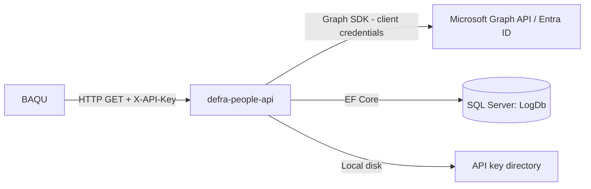

# Assessment - defra-people-api

## Identification

**Repository Name**: people-api (solution: `defra-people-api`)
**Type**: API (ASP.NET Core minimal API / controller-hybrid)
**Language**: C#
**Frameworks**: .NET 8.0 (`Microsoft.NET.Sdk.Web`), Entity Framework Core 9.0.3 (SQL Server + InMemory), Microsoft Graph SDK 5.75.0, Azure.Identity 1.13.2, ASP.NET Core Health Checks
**Repository URL**: Local clone only — `people-api/`

## Summary
defra-people-api is a modern .NET 8 API service that acts as a thin, secured facade over Microsoft Graph API user lookups. It exposes endpoints to fetch user details by SID, mail nickname, and SAM account name, and is consumed directly by at least one other application in this portfolio (`baqu`). It implements a custom API-key authentication/authorization scheme (`ApiKeyAuthenticationOptions`), an admin API-key management surface (`generate-api-key`, `refresh-api-keys`, `list-api-keys`), and encrypts sensitive configuration (master key, admin API key) at rest using a custom `IEncryptionService`/`IEncryptedConfigService`.

The service also implements its own asynchronous logging pipeline (`ILogQueue`/`LogProcessingService` background hosted service writing to a `LogDbContext`/`LogDb` SQL Server database), health checks for both the Graph API dependency and its own database, and in-memory caching (`IUserCache`, `IApiKeyCacheService`) to reduce Graph API call volume.

## Service Dependencies

### Cloud Services (GCP/AWS/Azure)
- **Microsoft Graph API** (`Microsoft.Graph` 5.75.0, via `GraphClientFactory`/`GraphService`): primary data source for user information (`User.Read.All` scope) — client credentials flow using `GraphApi:ClientId`/`ClientSecret`/`TenantId`
- **Azure.Identity** (1.13.2): present as a dependency — likely used for Graph API authentication (client secret credential) or is a step toward future managed-identity adoption
- **Azure AD / Microsoft Entra ID** (implied): the app registration referenced in the README ("Azure AD application registration with Microsoft Graph API permissions") is the identity backing this integration

### Databases
- **LogDb** (`ConnectionStrings:LogDb`, EF Core 9 + SQL Server): stores API request/audit logs, written asynchronously via a background `LogProcessingService`

### Messaging
- None found (the "log queue" is an in-process/in-memory queue via `ILogQueue`, not a message broker)

### Storage
- **Local file directory**: `IApiKeyCacheService.LoadKeysFromDirectory()` loads API keys from a directory on disk at startup — needs a durable-storage equivalent (Azure Key Vault / Storage) for containerized/multi-instance Azure deployment

### APIs and External Integrations
- Consumed by: **BAQU** (`baqu` repo) — confirmed via `PeopleRepository.cs`, which calls `/getusers/by-sid`, `/getusers/by-samaccount`, `/getusers/by-mailnickname` using the `X-API-Key` header
- Likely consumed by other legacy MVC apps in the estate that reference a "People" database directly today (`rpa-inspections-workbench`, `rpa-mts-inspections`, `rpa-quality-checks` all have `PeopleContext` SQL connections) — this API may represent a **planned modernization target to replace direct People-database access** with a proper service boundary; recommend confirming this hypothesis with the application owner during Phase 1

### Other Dependencies
- `AspNetCore.HealthChecks.UI.Client` — standard health check UI/formatter package

## Communication

### Exposed Endpoints
| Method | Path | Description | Authentication |
|--------|------|--------------|-----------------|
| GET | `/` | Root/health placeholder | None documented |
| GET | `/getusers/by-sid` | Look up user by SID | API Key (`X-API-Key`) |
| GET | `/getusers/by-mailnickname` | Look up user by mail nickname | API Key |
| GET | `/getusers/by-samaccount` | Look up user by SAM account name | API Key |
| GET | `/admin/list-api-keys` | List issued API keys | API Key + `Admin` policy |
| POST | `/admin/generate-api-key` | Generate a new API key | API Key + `Admin` policy |
| POST | `/admin/refresh-api-keys` | Refresh/reload API keys | API Key + `Admin` policy |
| (health) | `/health` (via `AddHealthChecks`) | Graph API + database + self health probes | Not confirmed — verify before exposing publicly |

### Consumed Endpoints
| Service | Method | Endpoint | Purpose |
|---------|--------|----------|---------|
| Microsoft Graph | GET | `graph.microsoft.com/v1.0/users/...` | Resolve user profile + manager information |

### Asynchronous Communication
| Type | Name | Action | Purpose |
|------|------|--------|---------|
| Internal queue | `ILogQueue` / `LogProcessingService` (hosted service) | Enqueue → background flush | Asynchronously persist API request logs to `LogDb` without blocking request threads |

### Communication Diagram

## Configuration

### Environment Variables
- None explicit — configuration flows through `appsettings.json` + `appsettings.Development.json` + User Secrets + `secrets.template.json`

### Configuration Files
- `appsettings.json`: `GraphApi` (ClientId/ClientSecret/TenantId/Scopes), `ConnectionStrings:LogDb`, `Authentication:AdminApiKey`, `Encryption:MasterKey`
- `secrets.template.json`: local developer secrets template
- `update-permissions.ps1`: PowerShell script, likely grants file-system/service permissions

### Secrets and Sensitive Parameters
- `GraphApi:ClientSecret` — Azure AD app registration client secret (candidate for migration to a managed identity, removing the secret entirely)
- `Authentication:AdminApiKey` and `Encryption:MasterKey` — both explicitly encrypted-at-rest by the app itself (`EnsureMasterKeyEncrypted`/`EnsureAdminApiKeyEncrypted`) — README explicitly warns that losing/rotating `Encryption:MasterKey` invalidates all previously issued API keys, a **operational risk to flag prominently** during cutover planning
- Per-caller **API keys** are the sole authentication mechanism for all non-Graph endpoints — no OAuth2/Entra ID token validation for callers today

## Infrastructure

### Containerization
- **Dockerfile**: No
- **Base Image**: N/A (not yet containerized)

### Kubernetes/Helm
- **Manifests**: No

### Infrastructure as Code
- **Terraform/Bicep**: No

### CI/CD
- **Pipeline**: **Azure DevOps YAML pipeline present** (`azure-pipelines.yaml`) — this is the only application in the portfolio with a real, working CI/CD definition
- **Stages**: `BuildAndTest` (restore/build/test with code coverage via `dotnet test`), `DeployToNonProd` (conditional on tag pattern `v*-NONPROD`, uses `FileTransform@2` to inject `appsettings.json` values from a `People-API-NONPROD` variable group), `DeployToProd` (conditional on tag pattern `v*-PROD`, uses `People-API-PROD` variable group)
- **Deployment target**: pipeline publishes a zip artifact and stages a "deployable" package but the actual deploy step is a placeholder (`echo "Deploying to ... environment"`) — **no live deployment task wired up yet** (e.g., no `AzureWebApp@1`/`AzureRmWebAppDeployment@4` task), meaning today's pipeline builds/tests/packages only

## Testing

### Coverage
- **Percentage**: Not measured in this pass, but the Azure DevOps pipeline explicitly runs `dotnet test` with `--collect:"XPlat Code Coverage"`, so CI-computed coverage exists and should be pulled from pipeline history
- **Tool**: presumably xUnit/NUnit (test project `defra-people-api-tests` present) — exact framework to confirm from the test `.csproj`

### Test Types
- **Unit**: Yes — `defra-people-api-tests` project exists and runs in CI
- **Integration**: Possibly (health check tests, Graph API mocking) — not confirmed in this pass
- **E2E**: Not evident

### Observations
This is the **best-tested and most CI/CD-mature** application in the portfolio.

## Points of Attention for Multi-Cloud/Azure Migration

### Cloud-Specific Dependencies
- Already Azure-AD/Graph-centric — low risk, but the Graph client-credential secret should move to **Managed Identity + Entra ID app role** rather than a stored client secret once hosted in Azure
- `Azure.Identity` package is already referenced, suggesting the team may already be planning/partway through this change

### Hardcoded Configurations
- API key file loading from a local directory (`LoadKeysFromDirectory`) — will not work correctly across multiple container/App Service instances without a shared, durable store (Azure Files, Blob Storage, or a database table)
- No containerization yet, despite the app already targeting the cross-platform-capable .NET 8 stack — a strong Azure Container Apps or App Service (Linux) candidate

### Legacy Code or Old Patterns
- None significant — this is the most modern application in the estate

### Specific Recommendations
1. Replace on-disk API-key storage with Azure Key Vault or a database table so the service can scale out horizontally on Azure App Service/Container Apps.
2. Replace the Graph API client-secret credential with a **system-assigned Managed Identity** + Entra ID application permissions once hosted on Azure compute.
3. Complete the Azure DevOps pipeline's deployment stages (currently placeholder `echo` steps) with real `AzureWebApp@1`/`AzureRmWebAppDeployment@4` (or GitHub Actions `azure/webapps-deploy`) tasks as part of Phase 5 (CI/CD).
4. Treat `Encryption:MasterKey` as a Key Vault secret with strict rotation/backup procedures given the README's explicit warning about key loss invalidating all issued API keys.
5. Confirm with the application owner whether this API is intended to **replace** direct "People" SQL Server database access currently used by `rpa-inspections-workbench`, `rpa-mts-inspections`, and `rpa-quality-checks` — if so, this becomes a cross-repo migration dependency/sequencing decision for the portfolio roadmap.
6. Containerize with a standard ASP.NET Core Dockerfile (multi-stage build) as part of Phase 3 infra generation — no code blockers identified.

## Additional Observations
- This application is the clearest candidate to lead the migration wave, given its modern stack, existing CI, and existing test coverage — recommend sequencing it early in the portfolio roadmap so its API can be consumed as the "People" system of record by `baqu` and, potentially, the legacy MVC apps still querying the People database directly.
